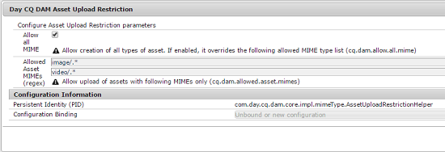
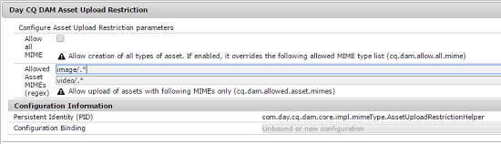

# Konfigurera överföringsbegränsningar för resurser {#configuring-asset-upload-restrictions}

Du kan konfigurera [!DNL Adobe Experience Manager Assets] för att begränsa vilken typ av resurser som användare kan överföra. Det förhindrar oavsiktliga överföringar av oönskade format och skadliga filer. Med tjänsten `Day CQ DAM Asset Upload Restriction` kan du styra vilken typ av filer som användare kan överföra. Som standard tillåter [!DNL Assets] användare att överföra resurser av alla MIME-typer. Du kan dock konfigurera tjänsten så att den begränsar användare till att överföra filer av specifika MIME-typer.

1. Öppna Configuration Manager-webbkonsolen. Åtkomst till `https://[aem_server]:[port]/system/console/configMgr`.
1. Öppna tjänsten **[!UICONTROL Day CQ DAM Asset Upload Restriction]** i redigeringsläge. Som standard är alternativet **Tillåt alla MIME** markerat, vilket gör att användare kan överföra filer av alla MIME-typer.

   

1. Om du vill att användarna bara ska kunna överföra filer av vissa MIME-typer avmarkerar du alternativet **[!UICONTROL Allow all MIME]** och anger tillåtna MIME-typer i fälten **[!UICONTROL Allowed Asset MIMEs (regex)]** med reguljära uttryck.

   

1. Klicka på **[!UICONTROL Save]** om du vill spara ändringarna. Om du anger MIME-strängar för tillåtna MIME-typer misslyckas överföringen för alla resurser med en MIME-typ som inte matchar de konfigurerade MIME-strängarna i dessa fält.
