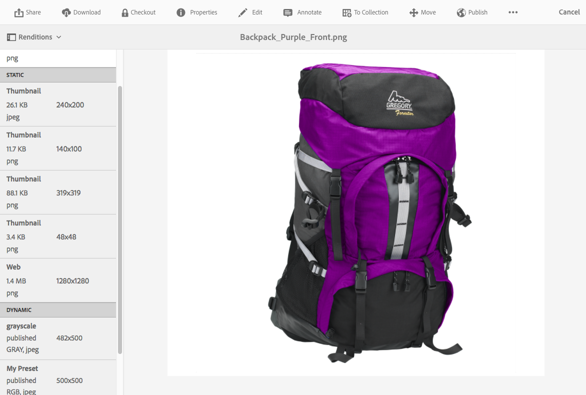

# Arbeta med Dynamic Media {#working-with-dynamic-media}

[Dynamic Media](https://business.adobe.com/products/experience-manager/assets/dynamic-media.html) hjälper till att leverera visuella marknadsförings- och marknadsföringsresurser on demand, som automatiskt skalas för konsumtion på webben, mobiler och sociala medier. Med hjälp av en uppsättning primära källresurser genererar och levererar programvaran flera varianter av avancerat innehåll i realtid via sitt globala, skalbara, prestandaoptimerade nätverk.

Programvaran ger interaktiva visningsfunktioner som zoomning, 360-graders rotation och video. Det innehåller de unika arbetsflödena i Adobe Experience Manager Digital Asset Management (Assets) för att förenkla och effektivisera hanteringen av digitala kampanjer.

<!-- >ARTICLE IS MISSING. GIVES 404 [!NOTE]
>
>A Community article is available on [Working with Adobe Experience Manager and Dynamic Media](https://helpx.adobe.com/experience-manager/using/aem_dynamic_media.html). -->

## Vad du kan göra med programvaran {#what-you-can-do-with-dynamic-media}

Med kan du hantera dina resurser innan du publicerar dem. Hur du arbetar med resurser i allmänhet beskrivs i detalj i [Arbeta med digitala resurser](manage-assets.md). Allmänna ämnen är bland annat att ladda upp, ladda ned, redigera och publicera resurser, visa och redigera egenskaper och söka efter resurser.

Funktioner som bara är dynamiska media inkluderar följande:

* [Carousel Banners](carousel-banners.md)
* [Bilduppsättningar](image-sets.md)
* [Interaktiva bilder](interactive-images.md)
* [Interaktiva videoklipp](interactive-videos.md)
* [Blandade medieuppsättningar](mixed-media-sets.md)
* [Panorambilder](panoramic-images.md)

* [Snurra uppsättningar](spin-sets.md)
* [Video](video.md)
* [Leverera dynamiska medieresurser](delivering-dynamic-media-assets.md)
* [Hantera resurser](managing-assets.md)
* [Skapa anpassade popup-fönster med snabbvyn](custom-pop-ups.md)

Se även [Konfigurera dynamiska media](administering-dynamic-media.md).

>[!NOTE]
>
>Mer information om skillnaderna mellan att använda Dynamic Media och att integrera Dynamic Media Classic med Adobe Experience Manager finns i [Dynamic Media Classic-integrering jämfört med Dynamic Media](/help/sites-administering/scene7.md#aem-scene-integration-versus-dynamic-media).

## Dynamiska media aktiverat jämfört med Dynamic Media inaktiverat {#dynamic-media-on-versus-dynamic-media-off}

Du kan se om programvaran är aktiverad (påslagen) enligt följande:

* Dynamiska återgivningar är tillgängliga när du hämtar eller förhandsgranskar resurser.
* Bilduppsättningar, snurruppsättningar, blandade medieuppsättningar är tillgängliga.
* PTIFF-återgivningar skapas.

När du väljer en bildresurs ser resursen annorlunda ut än programvaran [enabled](config-dynamic.md#enabling-dynamic-media). Den använder on-demand-visningsprogrammen från HTML5.

### Dynamiska renderingar {#dynamic-renditions}

Dynamiska återgivningar som bild- och visningsinställningar (under **[!UICONTROL Dynamic]**) är tillgängliga när programmet är aktiverat.

### Bilduppsättningar, snurruppsättningar, blandade medieuppsättningar {#image-sets-spins-sets-mixed-media-sets}

Uppsättningar med bilder, snurra och blandade medieuppsättningar är tillgängliga om programmet är aktiverat.

### PTIFF-återgivningar {#ptiff-renditions}

Dynamiska mediaaktiverade resurser innehåller `pyramid.tiffs`.

### Ändra resursvyer {#asset-views-change}

När programmet är aktiverat kan du zooma in och ut genom att klicka på knapparna `+` och `-`. Du kan också klicka för att zooma in i ett visst område. Med Återställ återgår du till den ursprungliga versionen och du kan göra bilden i helskärmsläge genom att klicka på de diagonala pilarna. När programmet är aktiverat ser det ut så här:

När programmet är inaktiverat kan du zooma in och ut och återgå till den ursprungliga storleken:

