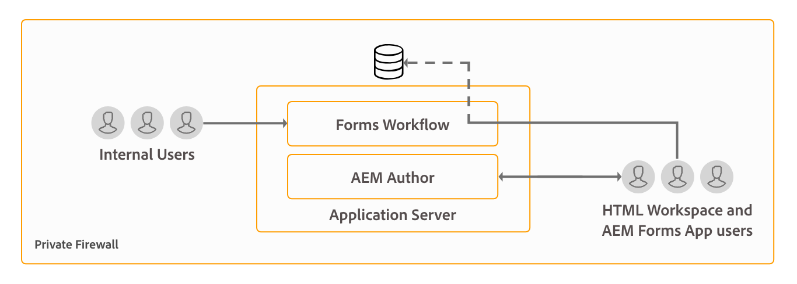

# Arkitektur och driftsättningstopologier för AEM Forms {#architecture-and-deployment-topologies-for-aem-forms}

| Version | Artikellänk |
| -------- | ---------------------------- |
| AEM as a Cloud Service | [Klicka här](https://experienceleague.adobe.com/docs/experience-manager-cloud-service/content/forms/forms-overview/aem-forms-cloud-service-architecture.html) |
| AEM 6.5 | Den här artikeln |

## Arkitektur {#architecture}

AEM Forms är ett program som distribueras till AEM som ett AEM-paket. Paketet kallas för AEM Forms tilläggspaket. AEM Forms-tilläggspaketet innehåller båda tjänsterna (API-providers), som distribueras i AEM OSGi-behållaren, och servlets eller JSP (som tillhandahåller både front-end- och REST API-funktioner) som hanteras av AEM Sling-ramverket. I följande diagram visas den här konfigurationen:

Arkitekturen för AEM Forms innehåller följande komponenter:

* **AEM bastjänster:** Grundläggande tjänster som AEM tillhandahåller ett distribuerat program. Dessa tjänster omfattar en JCR-kompatibel innehållsdatabas, en OSGI-tjänstbehållare, en arbetsflödesmotor, ett förtroendearkiv, en nyckelbehållare osv. Dessa tjänster är tillgängliga för AEM Forms-program, men tillhandahålls inte av AEM Forms-paket. Dessa tjänster är en integrerad del av den övergripande AEM-stacken och olika AEM Forms-komponenter använder dessa tjänster.
* **Forms-tjänster:** Tillhandahåller formulärrelaterade funktioner som att skapa, sammanställa, distribuera och arkivera PDF-dokument, lägga till digitala signaturer för att begränsa åtkomst till dokument och avkoda streckkodsformulär. Dessa tjänster är allmänt tillgängliga för användning av anpassad kod som distribueras samtidigt i AEM.
* **Webblager:** JSP:er eller serverlets, som är byggda över vanliga tjänster och formulärtjänster och som har följande funktioner:

   * **Författare**: Ett användargränssnitt för att skapa och hantera formulär.
   * **Formuläråtergivning och inskickande klientdel**: Ett användarvänligt gränssnitt för slutanvändare som kan användas av AEM Forms (till exempel för medborgare som använder en myndighets webbplats). Detta ger formuläråtergivning (visa formulär i en webbläsare) och funktioner för att skicka in formulär.
   * **REST API:er**: JSP:er och serverlets exporterar en delmängd av formulärtjänster för fjärrkonsumtion av HTTP-baserade klienter, till exempel SDK för formulär.

**AEM Forms på OSGi:** En AEM Forms på OSGi-miljö är AEM standardförfattare eller AEM Publish med AEM Forms-paket distribuerat på den. Du kan köra AEM Forms på OSGi i en [servermiljö, en servergrupp och grupperade konfigurationer](/help/sites-deploying/recommended-deploys.md). Klusterinställningar är bara tillgängliga för AEM Author-instanser.

<!--

**AEM Forms on JEE:** AEM Forms on JEE is AEM Forms server running on JEE stack. It has AEM Author with AEM Forms add-on packages and additional AEM Forms JEE capabilities co-deployed on a single JEE stack running on an application server. You can run AEM Forms on JEE in single-server and clustered setups. AEM Forms on JEE is required only to run document security, process management, and for LiveCycle customers upgrading to AEM Forms. Here are a few additional scenarios to use AEM Forms on JEE:

* **HTML workspace support (for customers using HTML workspace):** AEM Forms on JEE enables single sign-on with Processing instances, serves certain assets rendered on Processing instances, and handles submission of forms rendered within the HTML workspace.
* **Advanced additional form/interactive communication data processing**: AEM Forms on JEE can be utilized for additionally processing form/interactive communication data (and saving the results to a suitable data store) in complex use-cases where advanced process-management capabilities are required.

AEM Forms on JEE also includes provides following supporting services to the AEM components:

* **Integrated user management:** Allows users of AEM Forms on JEE to be recognized as AEM forms on OSGi users and helps enable SSO for both OSGi and JEE users. This is required for scenarios where single sign-on between AEM forms on OSGi and AEM Forms on JEE is required (for example, HTML workspace).
* **Asset hosting:** AEM Forms on JEE can serve assets (for example, HTML5 forms) rendered on AEM Forms on OSGi.

-->

AEM Forms redigeringsgränssnitt stöder inte skapande av DOR (Document of Record), PDF forms och HTML5 Forms. Sådana resurser är utformade med den fristående Forms Designer-applikationen och överförs individuellt till AEM Forms Manager. <!--Alternatively, for AEM Forms on JEE, forms can be designed as application (in AEM Forms Workbench) assets and deployed into AEM Forms on JEE server.-->

AEM Forms på OSGi <!--and AEM Forms on JEE both--> har arbetsflödesfunktioner. Du kan snabbt skapa och distribuera grundläggande arbetsflöden för olika uppgifter i AEM-formulär på OSGi.<!--, without having to install the full-fledged Process Management capability of AEM Forms on JEE. There is some difference in the [features of Form-centric workflow on AEM Forms on OSGi and Process Management capability of AEM Forms on JEE](capabilities-osgi-jee-workflows.md). The development and management of Form-centric workflows on AEM Forms on OSGi uses the familiar AEM Workflow and AEM Inbox capabilities.-->

## Terminologies {#terminologies}

Följande bild visar olika AEM Form Server-konfigurationer och deras komponenter som används i en typisk AEM Forms-distribution:

**Författare:** En författarinstans är en AEM Forms-server som körs i standardkörningsläget för författare. <!--It can be AEM Forms on JEE or AEM Forms on OSGi environment.--> Den är avsedd för interna användare, formulär och interaktiva kommunikationsdesigners samt utvecklare. Det aktiverar följande funktioner:

* **Skapa och hantera formulär och interaktiv kommunikation:** Designers och utvecklare kan skapa och redigera adaptiva formulär och interaktiv kommunikation, överföra andra typer av formulär som skapats externt, till exempel formulär som skapats i Adobe Forms Designer, och hantera dessa resurser med Forms Manager-konsolen.
* **Publicering av formulär och interaktiv kommunikation:** Assets på en författarinstans kan publiceras till en publiceringsinstans för körningsåtgärder. Resurspublicering använder AEM replikeringsfunktioner. Adobe rekommenderar att en replikeringsagent konfigureras på alla författarinstanser för att manuellt skicka publicerade formulär till bearbetningsinstanser, och en annan replikeringsagent konfigureras för att bearbeta instanser med utlösaren *Vid mottagande* aktiverad för att automatiskt replikera mottagna formulär till publiceringsinstanser.

**Publicera:** En publiceringsinstans är en AEM Forms-server som körs i det vanliga publiceringskörningsläget. Publiceringsinstanser är avsedda för slutanvändare av formulärbaserade program, t.ex. användare som öppnar en offentlig webbplats och som skickar formulär. Det aktiverar följande funktioner:

* Återge och skicka Forms för slutanvändare.
* Transport av obearbetade inlämnade formulärdata till bearbetningsinstanser för vidare bearbetning och lagring i det slutliga databassystemet. Standardimplementeringen i AEM Forms uppnår detta med funktionerna för omvänd replikering i AEM. Det finns också en alternativ implementering för att skicka formulärdata direkt till bearbetningsservrar i stället för att spara dem lokalt först (det senare är en förutsättning för att omvänd replikering ska aktiveras). Kunder som oroar sig för lagring av potentiellt känsliga data i publiceringsinstanser kan gå in för den här [alternativa implementeringen](/help/forms/using/configuring-draft-submission-storage.md) eftersom bearbetningsinstanser vanligtvis ligger i en säkrare zon.
* Återge och skicka interaktiva meddelanden och brev: En interaktiv kommunikation och ett interaktivt brev återges på publiceringsinstanser och motsvarande data skickas till bearbetningsinstanser för lagring och efterbearbetning. Data kan antingen sparas lokalt på en publiceringsinstans och återreplikeras till en bearbetningsinstans (standardalternativet) senare, eller skickas direkt till bearbetningsinstansen utan att sparas i publiceringsinstansen. Den senare implementeringen är användbar för säkerhetsmedvetna kunder.

**Bearbetning:** En instans av AEM Forms som körs i redigeringsläge utan användare tilldelade till formulärhanteringsgruppen. Du kan distribuera <!--AEM Forms on JEE or--> AEM Forms på OSGi som en bearbetningsinstans. Användarna är inte tilldelade att säkerställa att formulärredigerings- och hanteringsaktiviteter inte utförs på Bearbetning-instansen och bara inträffar på Author-instansen. En bearbetningsinstans aktiverar följande funktioner:

* **Bearbetning av råformulärsdata som kommer från en publiceringsinstans:** Detta uppnås huvudsakligen med en Bearbetningsinstans via AEM-arbetsflöden som utlöser när data kommer. I arbetsflödena kan du använda steget Formulärdatamodell som du får när du vill arkivera data eller dokument i ett lämpligt datalager.
* **Säker lagring av formulärdata**: Bearbetningen ger en databas bakom brandväggen för råformulärdata som är isolerad från användare. Varken formulärdesigners på författarinstansen eller slutanvändare på publiceringsinstansen har åtkomst till den här databasen.

  >[!NOTE]
  >
  >Adobe rekommenderar att du använder ett datalager från tredje part för att spara bearbetade data i stället för att använda AEM-databasen.

* **Lagring och efterbearbetning av korrespondensdata som kommer från en publiceringsinstans:** AEM-arbetsflöden utför den valfria efterbearbetningen av motsvarande bokstavsdefinitioner. Dessa arbetsflöden kan spara de slutliga bearbetade data i lämpliga externa datalager.

* **HTML Workspace som värd**: En bearbetningsinstans är värd för HTML Workspace. HTML arbetsyta innehåller användargränssnittet för associerade uppgifter/grupptilldelningar för gransknings- och godkännandeprocesser.

En bearbetningsinstans har konfigurerats att köras i redigeringskörningsläget på grund av:

* Det möjliggör omvänd replikering av råformulärdata från en Publish-instans. Standardhanteraren för datalagring kräver funktionen för omvänd replikering.
* AEM Workflows, som är det primära sättet att bearbeta råformulärsdata som kommer från en Publish-instans, rekommenderas för körning i ett system av utvecklartyp.

<!--

## Sample physical topologies for AEM Forms on JEE {#sample-physical-topologies-for-aem-forms-on-jee}

The AEM Forms on JEE topologies recommended below are mainly for customers upgrading from LiveCycle or a previous version of AEM Forms on JEE. Adobe recommends using AEM Forms on OSGi for fresh installations. A fresh installation of AEM Forms on JEE only recommended for using Document Security and Process Management capabilities.

### Topology for using document services or document security capabilities {#topology-for-using-document-services-or-document-security-capabilities}

AEM Forms customers planning to use only document services or document security capabilities can have a topology similar to the one displayed below. This topology recommends using a single instance of AEM Forms. You can also create a cluster or farm of AEM Forms servers, if necessary. This topology is recommended when most users programmatically access capabilities of AEM Forms server and intervention through the user interface is minimum. The topology is helpful in batch processing operations of document services. For example, using output service to create hundreds of non-editable PDF documents on daily basis.

Although, AEM Forms lets you set up and run all the functionalities from a single server, yet, you should do capacity planning, load balancing, and set up dedicated servers for specific capabilities in a production environment. For example, for an environment using the PDF Generator service to convert thousands of pages a day and add digital signatures to limit access to documents, set up separate AEM Forms servers for the PDF Generator service and digital signature capabilities. It helps provide optimum performance and scale the servers independent of each other.

### Topology for using AEM Forms process management {#topology-for-using-aem-forms-process-management}

AEM Forms customers planning to use AEM Forms process management features, for example, HTML Workspace can have a topology similar to the one displayed below. The AEM Forms on JEE server can be in a single server or cluster configuration.

If you are upgrading from LiveCycle ES4, this topology closely mirrors with what you already have in LiveCycle except for the addition of AEM Author built-in to AEM Forms on JEE. Moreover, there is no change in the clustering requirements for customers performing an upgrade. If you were using AEM Forms in a clustered environment, you can continue with same in AEM 6.5 Forms. For a fresh installation of AEM Forms of JEE for using HTML Workspace, running AEM author instance built-in to the JEE environment is an additional requirement.

Form data store is a third-party data store used for storing final processed data of forms and interactive communications. This is an optional element in the topology. You can also choose to set up a processing instance and use its repository as the final system-of-record system, if necessary.

The topology is recommended to the customers planning to use AEM Forms on JEE server for process management capabilities (HTML Workspace) without using any post-processing, adaptive forms, HTML5 forms, and interactive communication capabilities.

### Topology for using adaptive forms, HTML5 forms, interactive communication capabilities {#topology-for-using-adaptive-forms-html-forms-interactive-communication-capabilities}

AEM Forms customers planning to use AEM Forms data capture capabilities, for example, adaptive forms, HTML5 Forms, PDF Forms, can have a topology similar to the one displayed below. This topology is also recommended for using interactive communication capabilities of AEM Forms.

You can make the following changes/customizations to the above-suggested topology:

* Using HTML Workspace and AEM Forms app requires an AEM author or processing instance. You can use the AEM author instance built-in to AEM Forms on JEE server instead of setting up an additional external AEM author server.
* An AEM Author or Processing instance is required only for Forms-centric workflows on OSGi, adaptive forms, forms portal, and interactive communication.
* interactive communication Agent UI is generally run within the organization. So, you can keep a publish server for Agent UI within the private network.
* AEM forms on OSGi instance built-in to AEM Forms on JEE server can also run Forms-centric workflows on OSGi and Watched Folders.

-->

## Exempel på fysiska topologier för användning av AEM Forms i OSGi {#sample-physical-topologies-for-using-aem-forms-on-osgi}

### Topology for data capture, interactive communication, Form-Centric Workflow on OSGi capabilities {#topology-for-data-capture-interactive-communication-form-centric-workflow-on-osgi-capabilities}

AEM Forms-kunder som planerar att använda AEM Forms funktioner för datainhämtning, till exempel adaptiva formulär, HTML5 Forms, PDF forms, kan ha en topologi som liknar den som visas nedan. Den här topologin rekommenderas också för interaktiv kommunikation och Forms-centrerade arbetsflöden för OSGi-funktioner, till exempel för användning av AEM Inbox och AEM Forms App för arbetsflöden med affärsprocesser.

### Topologi för att använda bevakade mappfunktioner för batchbearbetning offline {#topology-for-using-watched-folder-capabilities-for-offline-batch-processing}

AEM Forms-kunder som planerar att använda bevakade mappar för batchbearbetning kan ha en topologi som liknar den som visas nedan. Topologin visar en klustrad miljö, men du bestämmer dig för att använda en enda instans eller en grupp AEM Forms-servrar beroende på inläsningen. Tredjepartsdatakällan är ditt eget postsystem. Den fungerar som indatakälla för bevakade mappar. Topologin visar också utdata i form av en utskriven fil. Du kan också lagra utdatainnehållet i ett filsystem, skicka via e-post och använda andra anpassade metoder för att förbruka utdata.

### Topologi för dokumenttjänster för offlinebaserad API-baserad bearbetning {#topology-for-using-document-services-capabilities-for-offline-api-based-processing}

AEM Forms-kunder som bara planerar att använda dokumenttjänster kan ha en topologi som liknar den som visas nedan. Den här topologin rekommenderar att du använder ett kluster av AEM Forms på OSGi-servrar. Den här topologin rekommenderas när de flesta användare använder API:er via programmering för att få åtkomst till AEM Forms-servrar och ett ingripande via användargränssnittet är minimum. Topologin är mycket användbar i olika kundscenarier. Till exempel kan flera klienter använda PDF Generator tjänst för att skapa PDF-dokument på begäran.

Även om du kan använda AEM Forms för att konfigurera och köra alla funktioner från en enda server, bör du göra kapacitetsplanering, lastbalansering och konfigurera dedikerade servrar för specifika funktioner i en produktionsmiljö. I en miljö där PDF Generator-tjänsten används för att konvertera tusentals sidor om dagen och flera adaptiva formulär för datainhämtning kan du skapa separata AEM Forms-servrar för PDF Generator-tjänsten och adaptiva formulärfunktioner. Det ger optimala prestanda och skalar servrarna oberoende av varandra.

