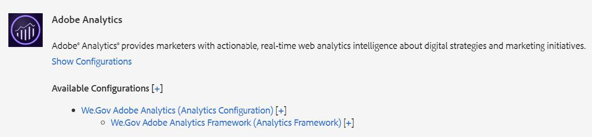
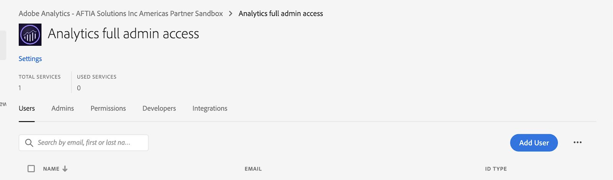
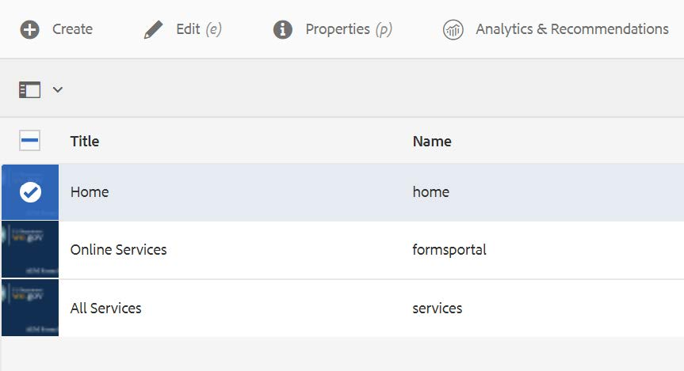
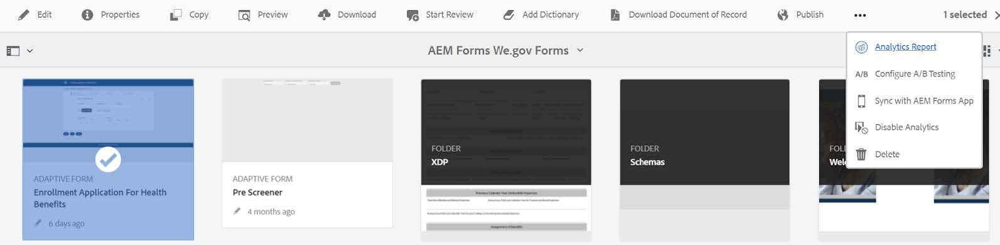
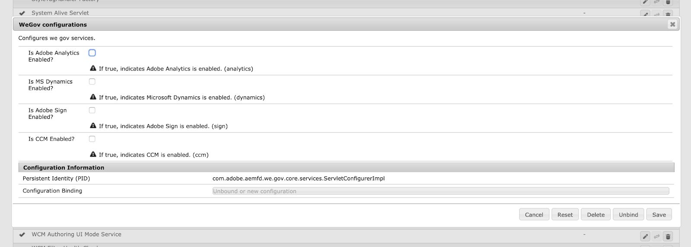

# Konfigurera referenswebbplatsen för Web.Gov och We-Finance {#set-up-and-configure-we-gov-reference-site}

## Information om demopaket {#demo-package-details}

### Installationskrav {#installation-prerequisites}

Det här paketet skapades för **AEM Forms 6.4 OSGI Author**, har testats och stöds därför på följande plattformsversioner:

| AEM VERSION | AEM FORMS PACKAGE VERSION | STATUS |
|---|---|---|
| 6,4 | 5.0.86 | **Stöds** |
| 6,5 | 6.0.80 | **Stöds** |
| 6.5.3 | 6.0.122 | **Stöds** |

Paketet innehåller en molnkonfiguration som stöder följande plattformsversioner:

| MOLNLEVERANTÖR | SERVICEVERSION | STATUS |
|---|---|---|
| Adobe Sign | v5 API | **Stöds** |
| Microsoft® Dynamics 365 | 1710 (9.1.0.3020) | **Stöds** |
| Adobe Analytics | v1.4 Rest API | **Stöds** |

**Paketinstallationshänsyn:**

* Installera paketet på en ren server, utan andra demopaket eller äldre versioner av demopaket.
* Installera paketet på en OSGI-server som körs i redigeringsläge.

### Vad innehåller det här paketet {#what-does-this-package-include}

[AEM Forms Web.Gov-demopaketet](https://experience.adobe.com/#/downloads/content/software-distribution/en/aem.html?package=/content/software-distribution/en/details.html/content/dam/aem/public/adobe/packages/cq650/featurepack/we-gov-forms.pkg.all-2.0.2.zip) (**we-gov-forms.pkg.all-&lt;version>.zip**) levereras som ett paket som innehåller flera andra underpaket och tjänster. Paketet innehåller följande moduler:

* **we-gov-forms.pkg.all-&lt;version>.zip** - *Fullständigt demopaket*

   * **we-gov-forms.ui.apps-&lt;version>.zip** *- Innehåller alla komponenter, klientbibliotek, exempelanvändare, arbetsflödesmodeller osv.*

      * **we-gov-forms.core-&lt;version>.jar** - *Innehåller alla OSGI-tjänster, anpassad implementering av arbetsflödessteg och så vidare.*

      * **we-gov-forms.derby&lt;version>.jar** - *Innehåller alla OSGI-tjänster, databasschema osv.*

      * **core.wcm.components.all-2.0.4.zip** - *Samling av WCM-exempelkomponenter*

      * **grid-aem.ui.apps-1.0-SNAPSHOT.zip** - *AEM Sites Grid-layoutpaket för kolumnkontroll för webbplatser*

   * **we-gov-forms.ui.content-&lt;version>.zip** - *Innehåller allt innehåll, alla sidor, bilder, formulär, interaktiva kommunikationsresurser osv.*

   * **we-gov-forms.ui.analytics-&lt;version>.zip** - *Innehåller alla Web.Gov Forms Analytics-data som ska lagras i databasen.*

   * **we-gov-forms.config.public-&lt;version>.zip** - *Innehåller alla standardkonfigurationsnoder inklusive platshållarmolnkonfigurationer för att undvika formulärdatamodell och tjänstbindningsproblem.*

De tillgångar som ingår i detta paket omfattar:

* AEM webbplatssidor med redigerbara mallar
* AEM Forms Adaptive Forms
* AEM Forms Interactive Communications (Print and Web Channel)
* AEM Forms XDP-dokument för inspelning
* AEM Forms MS® Dynamics Forms datamodell
* Integrering med Adobe Sign
* AEM Workflow Model
* AEM Assets exempelbilder
* Exempel (i minnet) på Apache Derby-databas
* Apache Derby Data Source (för användning med formulärdatamodell)

## Installation av demopaket {#demo-package-installation}

Det här avsnittet innehåller information om hur du installerar demopaketet.

### Från programvarudistribution {#from-software-distribution}

1. Öppna [Programvarudistribution](https://experience.adobe.com/downloads). Du behöver en Adobe ID för att logga in på Software Distribution.
1. Välj **[!UICONTROL Adobe Experience Manager]** som finns på rubrikmenyn.
1. I avsnittet **[!UICONTROL Filters]**:
   1. Välj **[!UICONTROL Forms]** i listrutan **[!UICONTROL Solution]**.
   2. Välj version och typ för paketet. Du kan också använda alternativet **[!UICONTROL Search Downloads]** för att filtrera resultaten.
1. Markera paketnamnet **we-gov-forms.pkg.all-&lt;version>.zip**, markera **[!UICONTROL Accept EULA Terms]** och välj **[!UICONTROL Download]**.
1. Öppna [Pakethanteraren](/help/sites-administering/package-manager.md) och klicka på **[!UICONTROL Upload Package]** för att överföra paketet.
1. Markera paketet och klicka på **[!UICONTROL Install]**.

   

1. Tillåt att installationsprocessen slutförs.
1. Gå till *https://&lt;aemserver>:&lt;port>/content/we-gov/home.html?wcmmode=disabled* för att kontrollera att installationen lyckades.

### Från en lokal ZIP-fil {#from-a-local-zip-file}

1. Hämta och hitta filen **we-gov-forms.pkg.all-&lt;version>.zip**.
1. Gå till *https://&lt;aemserver>:&lt;port>/crx/packmgr/index.jsp*.
1. Välj alternativet Överför paket.

   

1. Använd filläsaren för att navigera till och välja den hämtade ZIP-filen.
1. Klicka på Öppna för att överföra.
1. När du har överfört paketet väljer du alternativet Installera för att installera det.

   

1. Tillåt att installationsprocessen slutförs.
1. Gå till *https://&lt;aemserver>:&lt;port>/content/we-gov/home.html?wcmmode=disabled* för att kontrollera att installationen lyckades.

### Installera nya paketversioner {#installing-new-package-versions}

Installera den nya paketversionen genom att följa stegen i 4.1 och 4.2. Du kan installera en nyare paketversion även om en äldre version redan är installerad. Adobe rekommenderar dock att du avinstallerar den äldre paketversionen först. Gör så här:

1. Navigera till *https://&lt;aemserver>:&lt;port>/crx/packmgr/index.jsp*
1. Leta reda på den äldre filen **we-gov-forms.pkg.all-&lt;version>.zip**.
1. Välj alternativet **Mer**.
1. Välj alternativet **Avinstallera** i listrutan.

   

1. När du har bekräftat väljer du **Avinstallera** igen och tillåter att avinstallationen slutförs.

## Konfiguration av demonstrationspaket {#demo-package-configuration}

Det här avsnittet innehåller information och instruktioner om konfigurationen efter distributionen av demopaketet innan presentationen.

### Konfiguration av praktisk användare {#fictional-user-configuration}

1. Navigera till *https://&lt;aemserver>:&lt;port>/libs/granite/security/content/groupadmin.html*
1. Logga in som administratör för att utföra uppgifterna nedan.
1. Bläddra ned till slutet av sidan om du vill läsa in alla användargrupper.
1. Sök efter **arbetsflöde**.
1. Markera gruppen **workflow-users** och klicka på **Egenskaper**.
1. Gå till fliken Medlemmar.
1. Skriv **i fältet** Välj användare eller grupp`wegov`.
1. Välj i listrutan **We.Gov Forms Users**.

   

1. Klicka på **Spara och stäng** på menyraden.
1. Upprepa steg 2-7 genom att söka efter **analyser**, markera gruppen **Analysadministratörer** och lägga till gruppen **Web.Gov Forms Users** som medlem.
1. Upprepa steg 2-7 genom att söka efter **formuläranvändare**, markera gruppen **forms-power-users** och lägga till gruppen **We.Gov Forms Users** som medlem.
1. Upprepa steg 2-7 genom att söka efter **forms-users**, markera gruppen **forms-users** och lägga till gruppen **We.Gov Users** som medlem.

### E-postserverkonfiguration {#email-server-configuration}

1. Granska installationsdokumentationen [Konfigurerar e-postmeddelande](/help/sites-administering/notification.md)
1. Logga in som administratör för att utföra den här uppgiften.
1. Navigera till *https://&lt;aemserver>:&lt;port>/system/console/configMgr*
1. Leta upp och klicka på **Day CQ Mail Service** för att konfigurera.

   

1. Konfigurera tjänsten så att den ansluter till valfri SMTP-server:

   1. **SMTP-servervärdnamn**: till exempel (smtp.gmail.com)
   1. **Serverport**: till exempel (465) för gmail med SSL
   1. **SMTP-användare:** demo@ &lt;företagsnamn>.com
   1. **Från adress**: aemformsdemo@adobe.com

   

1. Klicka på **Spara** för att spara konfigurationen.

### (Valfritt) AEM SSL-konfiguration {#aemsslconfig}

Det här avsnittet innehåller information om hur du konfigurerar SSL på AEM-instansen för att kunna konfigurera Adobe Sign Cloud-konfigurationen.

**Referenser:**

1. [SSL som standard](/help/sites-administering/ssl-by-default.md)

**Anteckningar:**

1. Gå till https://&lt;port>/aem/inbox där du kan slutföra processen som beskrivs i länken för referensdokumentation ovan.
1. Paketet `we-gov-forms.pkg.all-[version].zip` innehåller ett exempel på en SSL-nyckel och ett certifikat som kan nås genom att extrahera mappen `we-gov-forms.pkg.all-[version].zip/ssl` som ingår i paketet.

1. SSL-certifikat och nyckelinformation:

   1. utfärdas till &quot;CN=localhost&quot;
   1. 10 års giltighet
   1. lösenordsvärde för password

1. Den privata nyckeln är *localhostprivate.der*.
1. Certifikatet är *localhost.crt*.
1. Klicka på **Nästa**.
1. Ange HTTPS-värdnamn till *localhost*.
1. Ange port till en port som systemet har exponerat.

### (Valfritt) Adobe Sign-molnkonfiguration {#adobe-sign-cloud-configuration}

Det här avsnittet innehåller information och instruktioner om Adobe Sign-molnkonfigurationen.

**Referenser:**

1. [Integrera Adobe Sign med AEM Forms](adobe-sign-integration-adaptive-forms.md)

#### Molnkonfiguration {#cloud-configuration}

1. Granska förutsättningarna. Se [AEM SSL-konfiguration](../../forms/using/forms-install-configure-gov-reference-site.md#aemsslconfig) för nödvändig SSL-konfiguration.
1. Navigera till:

   *https://&lt;aemserver>:&lt;port>/libs/adobesign/cloudservices/adobesign.html/conf/we-gov*

   >[!NOTE]
   >
   >För att undvika konfigurationsproblem ska du se till att den URL som används för att komma åt AEM-servern matchar den URL som konfigurerats i omdirigerings-URI:n för Adobe Sign OAuth.
   >Till exempel *https://&lt;aemserver>:&lt;port>/mnt/overlay/adobesign/cloudservices/adobesign/properties.html*

1. Välj **We.gov Adobe Sign**-konfigurationen.
1. Klicka på **Egenskaper**.
1. Gå till fliken Inställningar.
1. Ange autentiserings-URL. Till exempel `https://secure.na1.echosign.com/public/oauth` (endast för illustrationssyften).
1. Ange konfigurerat klient-ID och klienthemlighet från den konfigurerade Adobe Sign-instansen.
1. Klicka på **Anslut till Adobe Sign**.
1. När anslutningen är klar klickar du på **Spara och stäng** för att slutföra integreringen.

### (Valfritt) MS® Dynamics-molnkonfiguration {#ms-dynamics-cloud-configuration}

Det här avsnittet innehåller information och instruktioner om konfigurationen för MS® Dynamics Cloud.

**Referenser:**

1. [Microsoft](/help/forms/using/ms-dynamics-odata-configuration.md)
1. [Konfigurerar Microsoft® Dynamics för AEM Forms](https://experienceleague.adobe.com/sv/docs/experience-manager-learn/forms/adaptive-forms/using-ms-dynamics-with-aem-forms#)

#### Molntjänsten MS® Dynamics OData {#ms-dynamics-odata-cloud-service}

1. Navigera till:

   https://&lt;aemserver>:&lt;port>/libs/fd/fdm/gui/components/admin/fdmcloudservice/fdm.html/conf/we-gov

   1. Kontrollera att du använder samma omdirigerings-URL som konfigurerats i MS® Dynamics-programregistreringen för att få åtkomst till servern.

1. Välj konfigurationen för Microsoft® Dynamics OData Cloud Service.
1. Klicka på **Egenskaper**.

   

1. Gå till fliken Autentiseringsinställningar.
1. Ange följande information:

   1. **Tjänstrot:**, till exempel, `https://msdynamicsserver.api.crm3.dynamics.com/api/data/v9.1/`
   1. **Autentiseringstyp:** OAuth 2.0
   1. **Autentiseringsinställningar** (se [Konfigurationsinställningar för MS® Dynamics &#x200B;](../../forms/using/forms-install-configure-gov-reference-site.md#dynamicsconfig) för att samla in den här informationen):

      1. Klient-ID - även kallat program-ID
      1. Klienthemlighet
      1. OAuth-URL - till exempel [https://login.microsoftonline.com/common/oauth2/authorize](https://login.microsoftonline.com/common/oauth2/authorize)
      1. Uppdatera token-URL, till exempel [https://login.windows.net/common/oauth2/token](https://login.windows.net/common/oauth2/token)
      1. Åtkomsttoken-URL, till exempel [https://login.windows.net/common/oauth2/token](https://login.windows.net/common/oauth2/token)
      1. Auktoriseringsomfång - **openid**
      1. Autentiseringshuvud - **auktoriseringsansvarig**
      1. Resurs - till exempel `https://msdynamicsserver.api.crm3.dynamics.com`

   1. Klicka på C **onnect to OAuth**.

1. När autentiseringen är klar klickar du på **Spara och stäng** för att slutföra integreringen.

#### Konfigurationsinställningar för MS® Dynamics-molnet {#dynamicsconfig}

Stegen som beskrivs i det här avsnittet finns för att hjälpa dig att hitta klient-ID, klienthemlighet och information från din MS® Dynamics Cloud-instans.

1. Navigera till [https://portal.azure.com/](https://portal.azure.com/) och logga in.
1. Välj **Alla tjänster** på den vänstra menyn.
1. Sök efter eller navigera till **Appregistrering**.
1. Skapa eller välj en befintlig programregistrering.
1. Kopiera **program-ID** som ska användas som OAuth **klient-ID** i AEM molnkonfiguration
1. Klicka på **Inställningar** eller **Manifest** för att konfigurera **Reply URL:er.**

   1. Den här URL:en måste matcha den URL som används för att komma åt AEM-servern när OData-tjänsten konfigureras.

1. Klicka på **Tangenter** i inställningsvyn för att visa en ny nyckel (används som Klienthemlighet i AEM).

   1. Se till att behålla en kopia av nyckeln. Du kan inte visa den senare i Azure eller AEM.

1. Navigera till kontrollpanelen för instansen av MS® Dynamics för att hitta URL:en för resursen/tjänstroten.
1. Klicka på **Försäljning** eller din egen instanstyp i det övre navigeringsfältet och **Välj inställningar**.
1. Klicka på **Anpassningar** och **Resurser för utvecklare** längst ned till höger.
1. Hitta tjänstens rot-URL. Exempel:

   `https://msdynamicsserver.api.crm3.dynamics.com/api/data/v9.1/`

1. Mer information om URL:en för uppdaterings- och åtkomsttoken finns här:

   [https://learn.microsoft.com/en-us/rest/api/datacatalog/authenticate-a-client-app](https://learn.microsoft.com/en-us/rest/api/datacatalog/authenticate-a-client-app)

#### Testa Forms datamodell (Dynamics) {#testing-the-form-data-model}

När molnkonfigurationen är klar kanske du vill testa formulärdatamodellen.

1. Navigera till

   *https://&lt;aemserver>:&lt;port>/aem/forms.html/content/dam/formsanddocuments-fdm/we-gov*

1. Markera **We.gov Microsoft® Dynamics CRM FDM** och välj **Egenskaper**.

   

1. Gå till fliken **Uppdatera Source**.
1. Kontrollera att **Kontextmedveten konfiguration** är inställd på `/conf/we-gov` och att den konfigurerade datakällan är `ms-dynamics-odata-cloud-service`.

   

1. Redigera formulärdatamodellen.

1. Testa tjänsterna för att kontrollera att de ansluter till den konfigurerade datakällan.

   >[!NOTE]
   >
   >När du har testat tjänsterna klickar du på **Avbryt** för att se till att ofrivilliga ändringar inte sprids till formulärdatamodellen.

   >[!NOTE]
   >
   >Det har rapporterats att en omstart av AEM Server krävs för att datakällan ska kunna bindas till FDM.

   >[!NOTE]
   >
   >Adobe rekommenderar att du använder kommandot `Ctrl + C` för att starta om SDK. Starta om AEM SDK med alternativa metoder. Om du stoppar Java-processer kan det till exempel leda till inkonsekvenser i AEM utvecklingsmiljö.

#### Testa Forms datamodell (Derby) {#test-fdm-derby}

När molnkonfigurationen är klar kanske du vill testa Forms datamodell.

1. Navigera till *https://&lt;aemserver>:&lt;port>/aem/forms.html/content/dam/formsanddocuments-fdm/we-gov*

1. Markera **We.gov Enrollment FDM** och välj **Egenskaper**.

   

1. Gå till fliken **Uppdatera Source**.

1. Kontrollera att den **kontextmedvetna konfigurationen** är inställd på `/conf/we-gov` och att den konfigurerade datakällan är **We.Gov Derby DS**.

   

1. Klicka på **Spara och stäng**.

1. [Testa tjänsterna](work-with-form-data-model.md#test-data-model-objects-and-services) för att kontrollera att de ansluter till den konfigurerade Data Source

   * Om du vill testa anslutningen markerar du **HOMEMORTGAGEACCOUNT** och ger den en get-tjänst. Testa tjänsten och systemadministratörerna för att se vilka data som hämtas.

### Adobe Analytics-konfiguration (valfritt) {#adobe-analytics-configuration}

Det här avsnittet innehåller information och instruktioner om Adobe Analytics Cloud Configuration.

**Referenser:**

* [Integrera med Adobe Analytics](../../sites-administering/adobeanalytics.md)

* [Ansluta till Adobe Analytics och skapa ramverk](../../sites-administering/adobeanalytics-connect.md)

* [Visa sidanalysdata](../../sites-authoring/pa-using.md)

* [Konfigurera analyser och rapporter](configure-analytics-forms-documents.md)

* [Visa och förstå AEM Forms analysrapporter](view-understand-aem-forms-analytics-reports.md)

### Adobe Analytics Cloud tjänstkonfiguration {#adobe-analytics-cloud-service-configuration}

Det här paketet levereras förkonfigurerat för att ansluta till Adobe Analytics. Följ stegen nedan för att tillåta att den här konfigurationen uppdateras.

1. Navigera till *https://&lt;aemserver>:&lt;port>/libs/cq/core/content/tools/cloudservices.html*
1. Gå till Adobe Analytics och välj länken &quot;Visa konfigurationer&quot;.
1. Välj konfigurationen &quot;Web.Gov Adobe Analytics (Analytics Configuration)&quot;.

   

1. Klicka på knappen Redigera om du vill uppdatera Adobe Analytics-konfigurationen (du måste ange Delad hemlighet). Klicka på Anslut till analys för att ansluta och OK för att slutföra.

   

1. På samma sida klickar du på&quot;We.Gov Adobe Analytics Framework (Analytics Framework)&quot; om du vill uppdatera ramverkskonfigurationerna (se [Aktivera AEM-redigering](../../forms/using/forms-install-configure-gov-reference-site.md#enableauthoring) för att aktivera redigering).

#### Adobe Analytics Hitta användaruppgifter {#analytics-locating-user-credentials}

Leta reda på användarautentiseringsuppgifterna för ett Adobe Analytics-konto som kontoadministratören måste utföra följande åtgärder.

1. Gå till Adobe Experience Cloud-portalen.
Logga in med dina administratörsuppgifter
1. Välj ikonen Adobe Analytics på huvudkontrollpanelen.
   
1. Navigera till fliken Admin och markera alternativet Användarhantering (äldre)
   
1. Välj fliken **Användare**.
   
1. Välj önskad användare i listan över användare.
1. Rulla längst ned på sidan och inloggningsinformationen för användarna visas längst ned på sidan.
   
1. Användarnamnet och Delad hemlig information visas till höger om behörighetsrutan.
1. Användarnamnet har ett kolon inom namnet. All information till vänster om kolonet är användarnamnet och all information till höger om kolonet är företagsnamnet, som i följande exempel:

   *användarnamn : företagsnamn*

#### Konfigurera användarautentisering i Adobe Analytics {#setup-user-authentication}

Administratörer kan ge användare AEM analysbehörigheter genom att utföra följande åtgärder.

1. Gå till Adobe Admin Console.

1. Klicka på Analytics-instansen som visas för Admin Console.

   Finns på administratörsidans huvudsida.

1. Välj fullständig administratörsåtkomst för Analytics.

1. Lägg till en användare i profilen.

   

1. Klicka på fliken Behörigheter när användar-ID har mappats till profilen.

1. Kontrollera att alla behörigheter är mappade till profilen.

   

1. När behörigheterna har mappats över en användares möjlighet att logga in kan det ta några timmar.

### Adobe Analytics-rapportering {#adobe-analytics-reporting}

#### Visa rapporter om Adobe Analytics webbplatser {#view-adobe-analytics-sites-reporting}

>[!NOTE]
>
>Om du installerar paketet `we-gov-forms.ui.analytics-<version>.zip` är AEM Forms Analytics-data tillgängliga offline eller utan en Adobe Analytics Cloud-konfiguration. AEM Sites-data kräver en aktiv molnkonfiguration.

1. Navigera till *https://&lt;aemserver>:&lt;port>/sites.html/content*
1. Välj **AEM Forms Web.Gov Site** för att visa webbplatssidorna.
1. Välj en av webbplatssidorna (till exempel Home) och välj **Analytics &amp; Recommendations**.

   

1. På den här sidan ser du hämtad information från Adobe Analytics. Informationen gäller för AEM Sites-sidan. Den här informationen uppdateras regelbundet från Adobe Analytics och visas inte i realtid.

   

1. Tillbaka på sidan för sidvisning (som du kom åt i steg 3.) kan du även visa sidvyinformationen genom att ändra visningsinställningen så att objekt i **listvyn** visas.
1. Leta upp listrutan Visa och välj **Listvy**.

   

1. På samma meny väljer du **Visningsinställning** och markerar de kolumner som du vill visa i avsnittet **Analytics**.

   

1. Klicka på **Uppdatera** för att göra de nya kolumnerna tillgängliga.

   

#### Visa rapporter om Adobe Analytics-formulär {#view-adobe-analytics-forms-reporting}

>[!NOTE]
>
>AEM Forms Analytics-data är tillgängliga offline eller utan en Adobe Analytics Cloud-konfiguration. Den här möjligheten är true om paketet `we-gov-forms.ui.analytics-<version>.zip` är installerat. AEM Sites-data kräver dock en aktiv molnkonfiguration.

1. Navigera till

   *https://&lt;aemserver>:&lt;port>/aem/forms.html/content/dam/formsanddocuments/adobe-gov-forms*

1. Välj anpassningsformuläret &quot;Registreringsprogram för hälsoförmåner&quot; och välj alternativet &quot;Analysrapport&quot;.

   

1. Vänta tills sidan har lästs in och visa analysrapportdata.

   

### Adobe Automated Forms Configuration Enabled {#automated-forms-enablement}

För att installera och konfigurera AEM Forms med Adobe Forms måste användare av verktyget Konvertering ha följande:

1. Tillgång till Adobe Developer.

1. Behörighet att skapa en integrering med tjänsten Adobe Forms Conversion.

1. Adobe AEM 6.5 senaste Service Pack som körs som författare.

Läs följande innan du läser ytterligare instruktioner:

* [Konfigurera den automatiska formulärkonverteringstjänsten](https://experienceleague.adobe.com/sv/docs/aem-forms-automated-conversion-service/using/configure-service#)

#### Skapa en IMS-konfiguration - del 1 {#creating-ims-config}

Konfigurera tjänsten för att kommunicera korrekt med formulärkonverteringsverktyget som användare måste konfigurera tjänsten Identity Management System (IMS) för att kunna registrera sig hos Adobe I/O.

1. Navigera till https://&lt;adserver>:&lt;port> > Klicka på Adobe Experience
Ansvarig längst upp till vänster > Verktyg > Säkerhet > Adobe IMS-konfiguration.

1. Klicka på Skapa.

1. Utför åtgärderna i bilden nedan.

   

1. Glöm inte att hämta certifikatet.

1. Fortsätt inte med resten av konfigurationen - gå igenom avsnittet [Skapa integrering i Adobe I/O](#create-integration-adobeio)

>[!NOTE]
>
>Certifikatet som skapas i det här avsnittet kommer att användas för att skapa integreringstjänsten i Adobe I/O. När användarna har skapat integreringstjänsten kan de använda den informationen från Adobe I/O för att slutföra konfigurationen.

#### Skapa integrering i Adobe I/O {#create-integration-adobeio}

Se till att du har möjlighet att skapa en integrering inom din Adobe-domän om du inte kontaktar systemadministratören för att göra det.

1. Gå till [Adobe Developer Console](https://developer.adobe.com/console/).

1. Klicka på **Skapa integrering**.

1. Välj **Åtkomst till ett API**.

1. Se till att du är i rätt grupp (den övre högra listrutan).

1. I avsnittet Experience Cloud väljer du verktyget Forms-konvertering.

1. Klicka på **Fortsätt**.

1. Ange integreringens namn och beskrivning.

1. Använd den publika nyckeln från Avsnitt 2.1 för att placera den i integreringen av nyckeln.

1. Välj en profil för automatisk formulärkonvertering.

   

#### Skapar IMS-konfigurationsdel 2 {#create-ims-config-part-next}

Nu när du har skapat en integrering kan vi slutföra installationen av IMS-konfigurationen.

1. Klicka på integreringen i Adobe I/O för att visa anslutningsinformationen.

1. Navigera till din IMS-konfiguration i AEM (**Verktyg** > **Säkerhet** > **IMS**)

1. Klicka på **Nästa** på IMS-konfigurationsskärmen.

1. Ange auktoriseringsservern (värdet visas på skärmbilden).

1. Ange API-nyckeln.

1. Ange klienthemligheten (klicka på **exponera** på integreringen i Adobe I/O för att visa den).

1. Klicka på JWT-fliken i Adobe I/O för att hämta JWT-nyttolasten och klistra in den i nyttolasten för IMS-konfigurationen.

   

1. Klicka på IMS-konfigurationen och välj Hälsokontroll. Användarna ser följande resultat.

   

#### Konfigurera molnkonfiguration (Web.Gov AFC-produktion) {#configure-cloud-configuration}

När IMS-konfigurationen är klar kan du fortsätta att granska molnkonfigurationen i AEM. Om konfigurationen inte finns följer du de här stegen för att skapa molnkonfigurationen i AEM:

1. Öppna webbläsaren och gå till system-URL:en https://&lt;domän_namn>:&lt;system_port>

1. Klicka på Adobe Experience Manager längst upp till vänster på skärmen > Verktyg > Molntjänster > Automatiserad konversationskonfiguration för Forms.

1. Markera konfigurationsmappen som du vill placera konfigurationen i.

1. Klicka på Skapa.

1. Ange informationen i skärmbilden nedan.

   

1. Ange en titel och ett namn för konfigurationen.

1. Tjänst-URL:en för systemet är inställd på `https://aemformsconversion.adobe.io/`.

1. Mallens URL */conf/we-gov/settings/wcm/templates/we-gov-flamingo-template*.

1. Temas-URL: */content/dam/formSanddocuments-themes/adobe-gov-forms-themes/we-gov-theme*

1. Klicka på Nästa.

1. De två värdena för kryssrutorna var tomma för den här konfigurationen.

   Mer information om de här alternativen finns i [Konfigurera molntjänsten](https://experienceleague.adobe.com/sv/docs/aem-forms-automated-conversion-service/using/configure-service#configure-the-cloud-service).

#### Konfigurera molnkonfiguration (`We.Finance` AFC-produktion) {#configure-cloud-configuration-wefinance}

När IMS-konfigurationen är klar kan du fortsätta att skapa molnkonfigurationen i AEM.

1. Öppna webbläsaren och gå till system-URL:en https://&lt;domän_namn>:&lt;system_port>

1. Klicka på Adobe Experience Manager längst upp till vänster på skärmen > Verktyg > Molntjänster > Automatiserad konversationskonfiguration för Forms.

1. Markera konfigurationsmappen som du vill placera konfigurationen i.

1. Klicka på **Skapa**.

1. Ange informationen i skärmbilden nedan.

   

1. Ange en titel och ett namn för konfigurationen.

1. Systemets tjänst-URL är inställd på `https://aemformsconversion.adobe.io/`

1. Mall-URL: */conf/we-Finance/settings/wcm/templates/we-Finance-adaptive-form*

1. Temas-URL: */content/dam/formSanddocuments-themes/adobe-Finance-forms-themes/we-Finance-theme*

1. Klicka på **Nästa**.

1. De två värdena för kryssrutorna var tomma för den här konfigurationen.

   * Mer information om de här alternativen finns i [Konfigurera molntjänsten](https://experienceleague.adobe.com/sv/docs/aem-forms-automated-conversion-service/using/configure-service#configure-the-cloud-service).

#### Testa formulärkonverteringen (Anmälningsprogram för Web.GOV) {#test-forms-conversion}

När konfigurationen är klar kan användare testa den genom att överföra ett PDF-dokument.

1. Gå till AEM https://&lt;domän_namn>:&lt;system_port>

1. Klicka på **Forms** > **Forms &amp; Documents** > **AEM Forms We.gov Forms** > **AFC**.

1. Välj PDF för registreringsprogram för Web.GOV.

1. Klicka på **Starta automatisk konvertering** i det övre högra hörnet.

1. Användarna kan se alternativet enligt nedan.

   

1. När knappen är markerad visas följande alternativ för användarna:

   * Se till att användarna väljer konfigurationen *Web.Gov AFC Production*

   

   

1. Välj att starta konverteringen när du har konfigurerat alla alternativ som du vill använda.

1. När konverteringen börjar ser användarna följande:

   

1. När konverteringen är klar ser användarna följande:

   

   Klicka på mappen **Utdata** för att visa det genererade adaptiva formuläret.

#### Kända fel och anteckningar {#known-issues-notes}

Tjänsten Automated Forms Conversion innehåller [bästa praxis, kända komplexa mönster](https://experienceleague.adobe.com/sv/docs/aem-forms-automated-conversion-service/using/styles-and-pattern-considerations-and-best-practices#) och [kända fel](https://experienceleague.adobe.com/sv/docs/aem-forms-automated-conversion-service/using/known-issues#). Granska informationen innan du börjar använda tjänsten AEM Forms Automated Forms Conversion.

1. Skapa formuläret med Generera adaptiva formulär utan aktiverade databindningar om du vill binda formuläret till en FDM efter konverteringen.

1. Kontrollera att mallmappen har `jcr:read` för alla behörigheter aktiverade. Om behörigheten inte är angiven kan tjänstanvändaren inte läsa mallen från databasen och konverteringen misslyckas.

## Anpassningar av demopaket {#demo-package-customizations}

I det här avsnittet finns anvisningar om hur du anpassar demonstrationen.

### Anpassning av mallar {#templates-customization}

Redigerbara mallar finns på följande plats:

*https://&lt;aemserver>:&lt;port>/libs/wcm/core/content/sites/templates.html/conf/we-gov*

Mallarna innehåller mallarna AEM Site, Adaptive Form och Interactive Communications, som skapats och sammanställts med komponenter som finns på:

*https://&lt;aemserver>:&lt;port>/crx/de/index.jsp#/apps/we-gov/components*

#### Formatsystem {#customizetemplates}

Den här webbplatsen innehåller även klientbibliotek, varav ett importerar Bootstrap 4 ( [https://getbootstrap.com/](https://getbootstrap.com/) ). Det här klientbiblioteket är tillgängligt på

*https://&lt;aemserver>:&lt;port>/crx/de/index.jsp#/apps/we-gov/clientlibs/clientlib-base/css/bootstrap*

De redigerbara mallarna som ingår i det här paketet levereras även förkonfigurerade med mall-/sidprinciper som använder CSS-klasserna i Bootstrap 4 för sidnumrering, formatering och så vidare. Alla klasser har inte lagts till i mallprofilerna, men alla klasser som stöds av Bootstrap 4 kan läggas till i profilerna. En lista över tillgängliga klasser finns i följande:

[https://getbootstrap.com/docs/4.1/getting-started/introduction/](https://getbootstrap.com/docs/4.1/getting-started/introduction/)

Mallar som ingår i paketet har även stöd för Style System:

[Formatsystem](../../sites-authoring/style-system.md)

#### Malllogotyper {#template-logos}

Project DAM Assets innehåller också logotyper och bilder från We.Gov. Dessa resurser finns på:

*https://&lt;aemserver>:&lt;port>/assets.html/content/dam/we-gov*

När du redigerar sid- och formulärmallar kan du välja att uppdatera logotyper genom att redigera komponenterna Navigering och Sidfot. De här komponenterna har en konfigurerbar varumärkesdialogruta och logotypdialogruta som kan användas för att uppdatera logotyper:

Mer information finns i Redigera sidinnehåll:

[Redigera sidinnehåll](../../sites-authoring/editing-content.md)

### Anpassning av webbplatssidor {#sites-pages-customization}

Alla webbplatssidor är tillgängliga från: *https://&lt;aemserver>:&lt;port>/sites.html/content/we-gov*

Dessa webbplatssidor använder även AEM Grid-paketet för att styra layouten för några komponenter.

#### Formatsystem {#style-system}

Sidorna i paketet har även stöd för Style System:

[Formatsystem](../../sites-authoring/style-system.md)

Mer information om vilka format som stöds finns i [Anpassningsformatsystem för mallar](../../forms/using/forms-install-configure-gov-reference-site.md#customizetemplates).

### Anpassning av adaptiva blanketter {#adaptive-forms-customization}

Alla anpassningsbara formulär finns i:

*https://&lt;aemserver>:&lt;port>/aem/forms.html/content/dam/formsanddocuments/adobe-gov-forms*

Du kan anpassa de här formulären så att de passar vissa användningsområden. Redigera inte vissa fält och inskickningslogik för att säkerställa att formuläret fortsätter att fungera korrekt, som exempelvis följande:

**Registreringsprogram för hälsofördelar:**

* contact_id - dolt fält som används för att ta emot kontakt-ID för MS® Dynamics under överföringen
* Skicka - Inlämningsknappslogik kräver anpassning för att stödja återanrop. Dokumentationen beskriver anpassningen. Du måste dock skriva ett stort skript för att skicka formuläret och utföra både `POST`- och `GET`-åtgärder till MS® Dynamics via Forms datamodell.
* Rotpanelen - Händelsen Initialize används för att lägga till en MS® Dynamics-knapp i AEM Inbox på ett så lite påträngande sätt som möjligt eftersom alla AEM Inbox Granite-gränssnittskomponenter inte kan ändras.

#### Adaptiv formulärformatering {#adaptive-form-styling}

Anpassningsbara formulär kan också formateras med stilredigeraren eller temeredigeraren:

* [Textbunden formatering av adaptiva formulärkomponenter](inline-style-adaptive-forms.md)
* [Skapa och använda teman](themes.md)

### Anpassa arbetsflöden {#workflow-customization}

Enrollment Adaptive Forms skickas till ett OSGI-arbetsflöde för behandling. Arbetsflödet finns på *https://&lt;aemserver>:&lt;port>/conf/we-gov/settings/models/we-gov-process.html*.

På grund av vissa begränsningar innehåller det här arbetsflödet flera skript och anpassade arbetsflödessteg för OSGI. Dessa arbetsflödessteg skapades som allmänna steg och har inte skapats med konfigurationsdialogrutor. För närvarande bygger konfigurationen av arbetsflödesstegen på processargument.

All Java™-kod för arbetsflödessteg finns i paketet **we-gov-forms.core-&lt;version>.jar**.

## Demonstrationsfrågor och kända problem {#demo-considerations-and-known-issues}

Det här avsnittet innehåller information om demonstrationsfunktioner och designbeslut som kan kräva speciella överväganden under demonstrationsprocessen.

### Demoversioner {#demo-considerations}

* Enligt AGRS-159 ska namnet (för-, mitten- och efternamn) på kontakten som används i det anpassade registreringsformuläret vara unikt.
* Det anpassade registreringsformuläret skickar e-postmeddelandet från Adobe Sign till e-postmeddelandet som anges i formulärets e-postfält. E-postadressen kan inte vara samma e-postadress som e-postadressen som används för att konfigurera Adobe Sign Cloud-konfigurationen.

### Kända fel {#known-issues}

* (AGRS-120) Webbplatsnavigeringskomponenten stöder för närvarande inte kapslade underordnade sidor som är mer än två nivåer djupa.
* (AGRS-159) Aktuell MS® Dynamics FDM måste utföra två åtgärder först, först POST the Enrollment Adaptive Form data to Dynamics och sedan hämta användarposten för att hämta kontakt-ID:t. I det aktuella läget misslyckas hämtning av kontakt-ID om fler än två användare med samma namn finns i Dynamics, vilket inte tillåter att det anpassade registreringsformuläret skickas.

## Konfigurera hjälpmedelstestning {#configure-accessibility-testing}

### Aktivera tillgänglighetstestning av Chrome Add on {#enable-chrome-add-on}

Installera Chrome-plugin-programmet som finns här `https://chrome.google.com/webstore/detail/accessibility-developer-t/fpkknkljclfencbdbgkenhalefipecmb?hl=en` för att utföra tillgänglighetstestning. <!-- This URL is a 404. As such, fix and update this entire topic. We ought not to be writing about third-party software that we have no control over to avoid these 404s. Consider making this topic entirely generic and leaving it up to the user to choose their own Accessibility Testing add-on. -->

När du har installerat den läser du in sidan som du vill testa i Chrome Browser. Om du har flera flikar öppna kan resultatet påverkas. Därför är det bäst att bara ha en flik öppen. När sidan har lästs in **högerklickar** på sidan och väljer fliken **Granskningar** . Här väljer utvecklare granskningstypen som plugin-programmet för tillgänglighet utför. När du har valt de önskade alternativen klickar användaren på **Generera rapport** för att skapa ett PDF-dokument. PDF visar den övergripande tillgänglighetsgraderingen och vad som kan användas för att öka den övergripande tillgänglighetsgraderingen.

När rapporten har körts kan användarna förvänta sig följande:

Antalet som visas framför användarna är den övergripande tillgänglighetsgraderingen som de har fått. Det finns också en beskrivning av hur detta beräknades efter poängen.

Om du vill exportera dessa data klickar du på de tre knapparna till höger på skärmen och väljer bland de tillgängliga alternativen.

### Ultramarintema {#ultramarine-theme}

Det allmänt tillgängliga Ultramarine-temat som underhålls av Adobe är inbyggt i
`we-gov-forms.pkg.all-<version>.zip` installerbar ZIP-fil. Paketet installeras med CRX.

Användare av Package Manager kan komma åt Ultramarine-temat i AEM Forms genom att gå till **Forms** > **Themes** > **Reference Themes** > **Ultramarine-Accessible**.

## Konfigurationsalternativ {#configuration-options}

Användare kan konfigurera olika alternativ för arbetsflödestjänster, som omfattar följande:

1. Microsoft® Dynamics-post
1. Adobe Sign
1. AEM Custom Communication Management
1. Adobe Analytics

För att kunna konfigurera dem så att de aktiveras i arbetsflödet måste användarna utföra följande uppgifter.

1. Gå till https://&#39;[server]:[port]/system/console/configMgr.

1. Leta reda på *WebGov-konfigurationer*.

1. Öppna tjänstdefinitionen och aktivera de valda tjänsterna för att anropas i arbetsflödet.

   >[!NOTE]
   >
   >Bara för att en användare aktiverar tjänsten på Configuration Manager-sidan måste användaren ändå konfigurera en tjänstkonfiguration för att kunna kommunicera med de externa tjänster som efterfrågas.

   

1. När du är klar klickar du på Spara för att spara inställningarna.

## Nästa steg {#next-steps}

Du är redo att utforska referensplatsen för We.Gov. Mer information om hur du använder referenswebbplatsen Web.Gov och om hur du gör det finns i [Genomgång av referenswebbplatsen för Web.Gov](../../forms/using/forms-gov-reference-site-user-demo.md).
