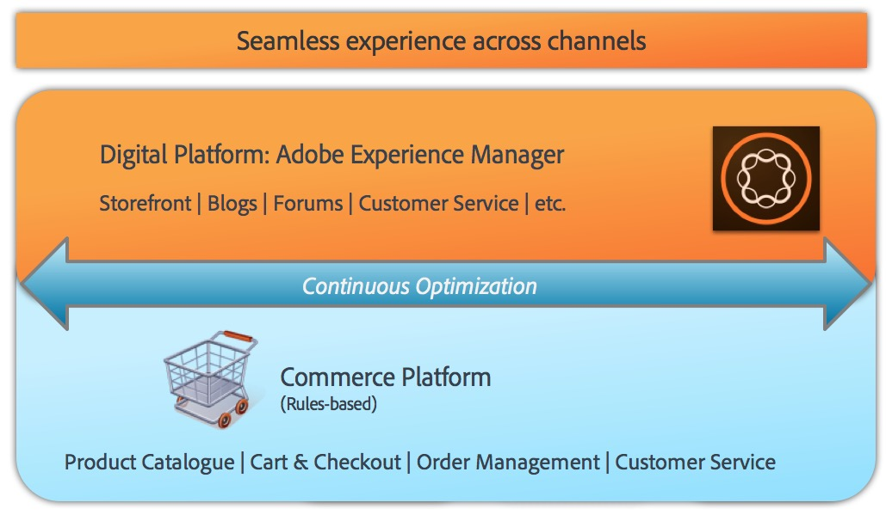

# AEM Commerce - beredskap för GDPR{#aem-commerce-gdpr-readiness}

>[!IMPORTANT]
>
>GDPR används som exempel i avsnitten nedan, men de ingående detaljerna gäller alla dataskydds- och sekretessbestämmelser, såsom GDPR och CCPA.

Europeiska unionens allmänna dataskyddsförordning om integritetsskydd får verkan från och med maj 2018. Se sidan [GDPR på Adobe Privacy Center](https://business.adobe.com/privacy/general-data-protection-regulation.html).

>[!NOTE]
>
>Mer information finns i [AEM GDPR-beredskap](/help/managing/data-protection-and-privacy.md).

Med Adobe körklara Commerce-integreringar är AEM upplevelselagret, konsumerar tjänster och skickar tillbaka data till kundens handelsplattform som körs i headlessläge.

För vissa e-handelsplattformar lagrar Adobe profilinformation ( `/home/users`) och e-handelstoken (för inloggning på e-handelsplattformen) i AEM. Läs [Hantera GDPR-förfrågningar för AEM-plattformen](/help/sites-administering/handling-gdpr-requests-for-aem-platform.md) för dessa användningsområden.

## Hantera GDPR-begäranden för AEM Commerce {#handling-gdpr-requests-for-aem-commerce}

För integreringen med Salesforce Commerce Cloud lagrar AEM Commerce ingen GDPR-relevant information. Vidarebefordra begäran till [Salesforce Cloud](https://documentation.b2c.commercecloud.salesforce.com/DOC1/index.jsp).

För hybris- och HCL WebSphere® Commerce-integreringar finns det vissa data i AEM. Använd [GDPR-instruktionerna för AEM-plattformen](/help/sites-administering/handling-gdpr-requests-for-aem-platform.md) och överväg följande frågor:

1. **Var lagras/används mina data?** cachelagrad användarprofilinformation som namn, användaridentifierare för e-handel, token, lösenord och adressdata som visas från AEM.
1. **Med vem delar jag GDPR-data som omfattas?** Alla uppdateringar av GDPR-relevanta data i AEM Commerce lagras inte (förutom relevant profilinformation, som nämns ovan), utan proxyskickas tillbaka till handelsplattformen.
1. **Hur tar jag bort mina användardata**? Ta bort användarprofilen i AEM och anropa användarborttagningen på handelsplattformen.

>[!NOTE]
>
>Ta en titt på [hybris wiki](https://wiki.hybris.com/) eller [HCL WebSphere® Commerce-dokumentationen](https://help.hcltechsw.com/commerce/index.html) om det behövs.
