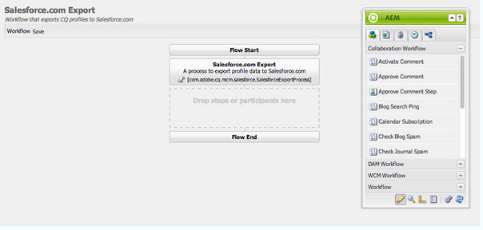

# Integrera med Salesforce {#integrating-with-salesforce}

Genom att integrera Salesforce med Adobe Experience Manager (AEM) får du funktioner för hantering av leads och använder de befintliga funktionerna som finns i kartongen från Salesforce. Du kan konfigurera AEM att skicka leads till Salesforce och skapa komponenter som får åtkomst till data direkt från Salesforce.

Tack vare den dubbelriktade och utbyggbara integrationen mellan AEM och Salesforce kan du

* Organisationer som vill använda och ändra data till fullo för att förbättra kundupplevelsen.
* Engagemang från marknadsföring till säljaktiviteter.
* Organisationer som automatiskt överför och tar emot data från ett datalager i Salesforce.

I det här dokumentet beskrivs följande:

* konfigurera Salesforce Cloud Services (konfigurera AEM att integrera med Salesforce).
* hur du använder Salesforce lead-/kontaktinformation i klientkontexten och för Personalization.
* hur du använder Salesforce arbetsflödesmodell för att publicera AEM-användare som leads till Salesforce.
* hur du skapar en komponent som visar data från Salesforce.

## Konfigurera AEM för integrering med Salesforce {#configuring-aem-to-integrate-with-salesforce}

För att konfigurera AEM så att det integreras med Salesforce måste du först konfigurera ett fjärråtkomstprogram i Salesforce. Sedan konfigurerar du Salesforce molntjänst så att den pekar på det här fjärråtkomstprogrammet.

>[!NOTE]
>
>Du kan skapa ett kostnadsfritt utvecklarkonto i Salesforce.

Så här konfigurerar du AEM för integrering med Salesforce:

>[!CAUTION]
>
>Installera integreringspaketet [Salesforce Force API](https://experience.adobe.com/#/downloads/content/software-distribution/en/aem.html?fulltext=salesforce*&amp;orderby=%40jcr%3Acontent%2Fjcr%3AlastModified&amp;orderby.sort=desc&amp;layout=list&amp;p.offset=0&amp;p.limit=2&amp;package=%2Fcontent%2Fsoftware-distribution%2Fen%2Fdetails.html%2Fcontent%2Fdam%2Faem%2Fpublic%2Fadobe%2Fpackages%2Fcq650%2Ffeaturepack%2Fcom.adobe.cq.mcm.salesforce.content-1.0.4.zip) innan du fortsätter med proceduren. Mer information om hur du arbetar med paket finns på sidan [Arbeta med paket](/help/sites-administering/package-manager.md#package-share).

1. I AEM går du till **molntjänster**. I tredjepartstjänster klickar du på **Konfigurera nu** i **Salesforce**.

   

1. Skapa en konfiguration, till exempel **utvecklare**.

   >[!NOTE]
   >
   >Den nya konfigurationen dirigeras om till en ny sida: **http://localhost:4502/etc/cloudservices/salesforce/developer.html**. Detta är exakt samma värde som du måste ange i återanrops-URL:en när du skapar fjärråtkomstprogrammet i Salesforce. Dessa värden måste matcha.

1. Logga in på ditt Salesforce-konto (eller om du inte har något, skapa ett på [https://developer.salesforce.com](https://developer.salesforce.com)).
1. I Salesforce går du till **Skapa** > **Appar** för att komma till **anslutna appar** (i tidigare versioner av Salesforce var arbetsflödet **Distribuera** > **Fjärråtkomst**).
1. Klicka på **Nytt** så att du kan ansluta AEM till Salesforce.

   

1. Ange det **anslutna appnamnet**, **API-namnet** och **e-postadressen till kontakten**. Markera kryssrutan **Aktivera OAuth-inställningar** och ange **Återanrops-URL** och lägg till ett OAuth-scope (till exempel fullständig åtkomst). Återanrops-URL:en ser ut ungefär så här: `http://localhost:4502/etc/cloudservices/salesforce/developer.html`

   Ändra servernamnet/portnumret och sidnamnet så att de matchar konfigurationen.

   

1. Klicka på **Spara** för att spara Salesforce-konfigurationen. Salesforce skapar en **konsumentnyckel** och en **konsumenthemlighet** som du behöver för AEM-konfigurationen.

   

   >[!NOTE]
   >
   >Vänta i flera minuter (upp till 15 minuter) tills fjärråtkomstprogrammet i Salesforce aktiveras.

1. I AEM går du till **molntjänster** och navigerar till den Salesforce-konfiguration du skapade tidigare (till exempel **utvecklare**). Klicka på **Redigera** och ange kundnyckeln och kundhemligheten på salesforce.com.

   

   | Inloggnings-URL | Detta är Salesforce Authorization Endpoint. Dess värde är förifyllt och fungerar i de flesta fall. |
   |---|---|
   | Kundnyckel | Ange det värde som hämtas från registreringssidan för fjärråtkomstprogram (RAS) i salesforce.com |
   | Kundhemlighet | Ange det värde som hämtas från registreringssidan för fjärråtkomstprogram (RAS) i salesforce.com |

1. Klicka på **Anslut till Salesforce** för att ansluta. Salesforce begär att du tillåter din konfiguration att ansluta till Salesforce.

   

   I AEM visas en bekräftelsedialogruta som talar om att du har anslutit.

1. Navigera till webbplatsens rotsida och klicka på **Sidegenskaper**. Välj sedan **Molntjänster** och lägg till **Salesforce** och välj rätt konfiguration (till exempel **utvecklare**).

   

   Nu kan du använda arbetsflödesmodellen för att publicera leads till Salesforce och skapa komponenter som hämtar data från Salesforce.

## Exportera AEM-användare som Salesforce Leads {#exporting-aem-users-as-salesforce-leads}

Om du vill exportera en AEM-användare som Salesforce lead konfigurerar du arbetsflödet för att skicka leads till Salesforce.

Så här exporterar du AEM-användare som Salesforce leads:

1. Navigera till arbetsflödet för Salesforce på `http://localhost:4502/workflow` genom att högerklicka på arbetsflödet **Salesforce.com** och klicka på **Start**.

   

1. Välj den AEM-användare som du vill skapa som lead som **nyttolast** för det här arbetsflödet (hem > användare). Se till att du väljer profilnoden för användaren eftersom den innehåller information som **givenName** och **familyName** som mappas till fälten **FirstName** och **LastName** för Salesforce lead.

   

   >[!NOTE]
   >
   >Innan arbetsflödet startas finns det vissa obligatoriska fält som en huvudnod i AEM måste ha innan den kan publiceras till Salesforce. Dessa är **givenName**, **familyName**, **company** och **email**. En fullständig lista över mappningar mellan AEM-användare och Salesforce lead finns i [Mappningskonfiguration mellan AEM-användare och Salesforce lead.](#mapping-configuration-between-aem-user-and-salesforce-lead)

1. Klicka på **OK**. Användarinformationen exporteras till salesforce.com. Du kan verifiera den på salesforce.com.

   >[!NOTE]
   >
   >I felloggarna visas om ett lead har importerats. Mer information finns i felloggen.

### Konfigurera arbetsflödet för Salesforce.com {#configuring-the-salesforce-com-export-workflow}

Om det behövs konfigurerar du arbetsflödet för Salesforce.com export så att det matchar rätt Salesforce.com eller gör andra ändringar.

Så här konfigurerar du arbetsflödet för Salesforce.com:

1. Navigera till `http://localhost:4502/cf#/etc/workflow/models/salesforce-com-export.html.`

   

1. Öppna steget Salesforce.com Exportera, välj fliken **Argument** och markera rätt konfiguration och klicka sedan på **OK**. Om du dessutom vill att arbetsflödet ska återskapa en lead som har tagits bort i Salesforce markerar du kryssrutan.

   

1. Klicka på **Spara** för att spara ändringarna.

   

### Mappningskonfiguration mellan AEM-användare och Salesforce Lead {#mapping-configuration-between-aem-user-and-salesforce-lead}

Om du vill visa eller redigera den aktuella mappningskonfigurationen mellan en AEM-användare och ett Salesforce-lead öppnar du Configuration Manager: `https://<hostname>:<port>/system/console/configMgr` och söker efter **Salesforce Lead Mapping Configuration**.

1. Öppna Configuration Manager genom att klicka på **webbkonsolen** eller gå direkt till `https://<hostname>:<port>/system/console/configMgr.`
1. Sök efter **Salesforce leadmappningskonfiguration**.

   

1. Ändra mappningar efter behov. Standardmappningen följer mönstret **aemUserAttribute=sfLeadAttribute**. Klicka på **Spara** för att spara ändringarna.

## Konfigurera Salesforce Client Context Store {#configuring-salesforce-client-context-store}

I Salesforce-klientkontextarkivet visas ytterligare information om den inloggade användaren än vad som redan finns i AEM. Den hämtar denna ytterligare information från Salesforce beroende på användarens anslutning till Salesforce.

Gör detta genom att konfigurera följande:

1. Länka en AEM-användare med ett Salesforce-id via Salesforce Connect-komponenten.
1. Lägg till Salesforce Profile Data på klientkontextsidan så att du kan konfigurera vilka egenskaper du vill se.
1. (Valfritt) Skapa ett segment som använder data från Salesforce Client Context Store.

### Länka en AEM-användare med ett Salesforce ID {#linking-an-aem-user-with-a-salesforce-id}

Mappa en AEM-användare med ett Salesforce-ID så att du kan läsa in det i klientkontexten. I ett verkligt scenario skulle du länka baserat på kända användardata med validering. I den här proceduren används komponenten **Salesforce Connect** för demonstrationssyften.

1. Navigera till en webbplats i AEM, logga in och dra och släpp **Salesforce Connect** -komponenten från sidosparken.

   >[!NOTE]
   >
   >Om **Salesforce Connect** -komponenten inte är tillgänglig går du till **designvyn** och markerar den för att göra den tillgänglig i **redigeringsvyn**.

   

   När du drar komponenten till sidan visas **Länk till Salesforce=Av**.

   

   >[!NOTE]
   >
   >Den här komponenten är endast avsedd som exempel. I verkliga scenarier finns det en annan process för att länka/matcha användare med leads.

1. När du har dragit komponenten på sidan öppnar du den för att konfigurera den. Välj konfiguration, typ av kontakt och Salesforce lead eller kontakt och klicka på **OK**.

   

   AEM länkar användaren till Salesforce kontakt eller lead.

   

### Lägga till Salesforce-data i klientkontexten {#adding-salesforce-data-to-client-context}

Du kan läsa in användardata från Salesforce i klientkontexten som ska användas för personalisering:

1. Öppna klientkontexten som du vill utöka genom att navigera där, till exempel `http://localhost:4502/etc/clientcontext/default/content.html.`

   

1. Dra **Salesforce Profile Data**-komponenten till klientkontexten.

   

1. Öppna komponenten genom att dubbelklicka. Välj **Lägg till objekt** och välj en egenskap i listrutan. Lägg till så många egenskaper du vill och välj **OK**.

   

1. Nu visas Salesforce-specifika egenskaper från Salesforce i klientkontexten.

   

### Skapa ett segment med data från Salesforce Client Context Store {#building-a-segment-using-data-from-salesforce-client-context-store}

Du kan skapa ett segment som använder data från Salesforce Client Context Store. Så här gör du:

1. Navigera till segmentering i AEM antingen genom att gå till **Verktyg** > **Segmentering** eller till [http://localhost:4502/miscadmin#/etc/segmentation](http://localhost:4502/miscadmin#/etc/segmentation).
1. Skapa eller uppdatera ett segment med data från Salesforce. Mer information finns i [Segmentering](/help/sites-administering/campaign-segmentation.md).

## Söker efter leads {#searching-leads}

AEM levereras med en exempelsökkomponent som söker efter leads i Salesforce enligt angivna villkor. Den här komponenten visar hur du använder Salesforce REST API för att söka efter Salesforce-objekt. Om du vill utlösa ett anrop till salesforce.com länkar du en sida med en Salesforce-konfiguration.

>[!NOTE]
>
>Detta är en exempelkomponent som visar hur du använder Salesforce REST API för att fråga efter Salesforce-objekt. Använd det som exempel för att skapa mer komplexa komponenter utifrån dina behov.

Så här använder du komponenten:

1. Navigera till sidan där du vill använda den här konfigurationen. Öppna sidegenskaperna och välj **Molntjänster.** Klicka på **Lägg till tjänster** och välj **Salesforce** och rätt konfiguration. Klicka sedan på **OK**.

   

1. Dra sökkomponenten för Salesforce till sidan (förutsatt att den har aktiverats). Om du vill aktivera det går du till designläge och lägger till det i lämpligt område).

   

1. Öppna sökkomponenten och ange sökparametrarna och klicka på **OK.**

   

1. AEM visar de leads som anges i sökkomponenten och som matchar de angivna villkoren.

   
