# Redigera sidinnehåll{#editing-page-content}

När sidan har skapats (antingen ny eller som en del av en programstart eller en live-kopia) kan du redigera innehållet för att få de uppdateringar du behöver.

Innehåll läggs till med [komponenter](/help/sites-authoring/default-components-console.md) (lämpliga för innehållstypen) som kan dras till sidan. Du kan sedan redigera dem på plats, flytta eller ta bort dem.

>[!NOTE]
>
>Ditt konto behöver [lämpliga åtkomsträttigheter](/help/sites-administering/security.md) och [behörigheter](/help/sites-administering/security.md#permissions) för att kunna redigera sidor.
>
>Om du råkar ut för problem föreslår Adobe att du kontaktar systemadministratören.

>[!NOTE]
>
>Om sidan, mallen eller båda är korrekt konfigurerade kan du använda en [responsiv layout](/help/sites-authoring/responsive-layout.md) när du redigerar.

>[!NOTE]
>
>I **redigeringsläget** visas länkar i ditt innehåll, men **är inte tillgängliga**. Använd [förhandsgranskningsläget](#previewingpagestouchoptimizedui) om du vill navigera med hjälp av länkarna i ditt innehåll.

## Verktygsfältet Sida {#page-toolbar}

Verktygsfältet för sidan ger tillgång till lämplig funktionalitet, beroende på sidkonfigurationen.

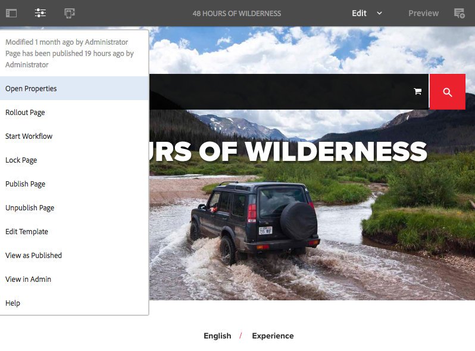

Verktygsfältet har många alternativ. Beroende på ditt aktuella sammanhang och din konfiguration kanske vissa alternativ inte är tillgängliga.

* **Växla sidopanel**

  Då öppnas/stängs sidopanelen, som innehåller [Resursläsaren](/help/sites-authoring/author-environment-tools.md#assets-browser), [Komponentbläddraren](/help/sites-authoring/author-environment-tools.md#components-browser) och [Innehållsträdet](/help/sites-authoring/author-environment-tools.md#content-tree).

  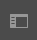

* **Sidinformation**

  Den ger åtkomst till menyn [Sidinformation](/help/sites-authoring/author-environment-tools.md#page-information), inklusive sidinformation och åtgärder som kan vidtas på sidan, inklusive visning och redigering av sidinformation, visning av sidegenskaper och publicering/avpublicering av sidan.

  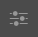

* **Emulator**

  Växlar verktygsfältet [emulator](/help/sites-authoring/responsive-layout.md#selecting-a-device-to-emulate), som används för att emulera sidans utseende och känsla på en annan enhet. Detta aktiveras automatiskt i layoutläge.

  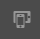

* **ContextHub**

  Öppnar [kontextnavet](/help/sites-authoring/ch-previewing.md). Endast tillgängligt i förhandsgranskningsläget.

  

* **Sidtitel**

  Detta är enbart informativt.

  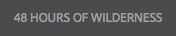

* **Lägesväljare**

  Det visar det aktuella [läget](/help/sites-authoring/author-environment-tools.md#page-modes) och gör att du kan välja ett annat läge, som redigering, layout, tidsförvrängning eller målinriktning.

  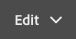

* **Förhandsgranska**

  Aktiverar [förhandsgranskningsläge](/help/sites-authoring/editing-content.md#preview-mode). Då visas sidan så som den ser ut när den publiceras.

  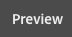

* **Anteckna**

  Du kan lägga till [anteckningar](/help/sites-authoring/annotations.md) på sidan när du granskar en sida. Efter den första anteckningen växlar ikonen till ett nummer som anger antalet anteckningar på sidan.

  

### Statusmeddelande {#status-notification}

Om en sida ingår i ett [arbetsflöde](/help/sites-authoring/workflows.md) eller flera arbetsflöden visas den här informationen i ett meddelandefält högst upp på skärmen när sidan redigeras.

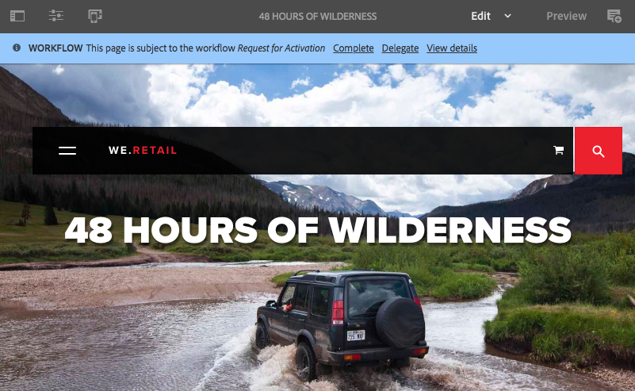

>[!NOTE]
>
>Statusfältet är bara synligt för användarkonton med lämplig behörighet.

I meddelandet visas arbetsflödet som körs mot sidan. Om användaren är involverad i det aktuella arbetsflödessteget finns även alternativ för att [påverka arbetsflödets status](/help/sites-authoring/workflows-participating.md) och få mer information om arbetsflödet tillgängliga, till exempel:

* **Fullständigt** - Öppnar dialogrutan **Fullständigt arbetsobjekt**

* **Delegera** - Öppnar dialogrutan **Fullständigt arbetsobjekt**

* **Visa information** - Öppnar fönstret **Information** i arbetsflödet

Att slutföra och delegera arbetsflödessteg via meddelandefältet fungerar som det gör när [deltar i arbetsflöden](/help/sites-authoring/workflows-participating.md) från meddelandeinkorgen.

Om sidan har flera arbetsflöden visas antalet arbetsflöden till höger om meddelandet tillsammans med pilknapparna så att du kan bläddra igenom arbetsflödena.

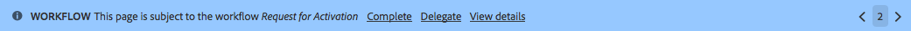

## Komponentplatshållare {#component-placeholder}

Komponentplatshållaren är en indikator som visar var en komponent placeras när du släpper den - ovanför den komponent som du håller pekaren över.

* När du lägger till en komponent på sidan (drar från komponentwebbläsaren):

  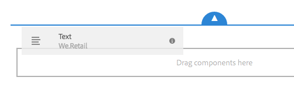

* När en befintlig komponent flyttas:

  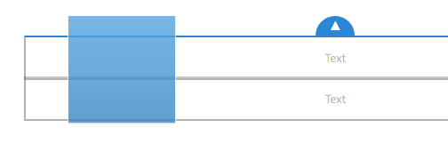

## Infoga en komponent {#inserting-a-component}

### Infoga en komponent från komponentwebbläsaren {#inserting-a-component-from-the-components-browser}

Du kan lägga till en komponent med [komponentwebbläsaren](/help/sites-authoring/author-environment-tools.md#components-browser). [komponentplatshållaren](#component-placeholder) visar var komponenten är placerad:

1. Kontrollera att sidan är i [**redigeringsläge**](/help/sites-authoring/author-environment-tools.md#page-modes).
1. Öppna [komponentwebbläsaren](/help/sites-authoring/author-environment-tools.md#components-browser).
1. Dra den nödvändiga komponenten till den [obligatoriska positionen](#component-placeholder).

1. [Redigera](#editmovecopypastedelete) komponenten.

>[!NOTE]
>
>Komponentwebbläsaren fyller hela skärmen på en mobil enhet. När du börjar dra en komponent stängs webbläsaren och sidan visas igen så att du kan montera komponenten.

### Infoga en komponent från styckesystemet {#inserting-a-component-from-the-paragraph-system}

Du kan lägga till en komponent genom att använda rutan **Dra komponenter hit** i styckesystemet:

1. Kontrollera att sidan är i [**redigeringsläge**](/help/sites-authoring/author-environment-tools.md#page-modes).
1. Det finns två sätt att markera och lägga till en komponent från styckesystemet:

   * Välj alternativet **Infoga komponent** (+) antingen i verktygsfältet för en befintlig komponent eller i rutan **Dra komponenter hit** .

   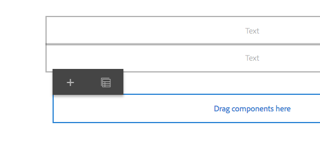

   * Om du använder en stationär enhet kan du dubbelklicka på rutan **Dra komponenter hit** .

   Dialogrutan **Infoga ny komponent** öppnas så att du kan välja önskad komponent:

   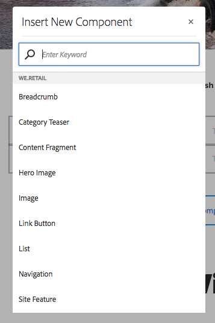

1. Den markerade komponenten läggs till längst ned på sidan. [Redigera](#editmovecopypastedelete) komponenten efter behov.

### Infoga en komponent med Assets Browser {#inserting-a-component-using-the-assets-browser}

Du kan också lägga till en komponent på sidan genom att dra en resurs från [resursläsaren](/help/sites-authoring/author-environment-tools.md#assets-browser). Då skapas automatiskt en komponent av lämplig typ (och som innehåller resursen).

Detta gäller för följande tillgångstyper (vissa är beroende av sidan/styckesystemet):

<table>
 <tbody>
  <tr>
   <th><strong>Resurstyp</strong></th>
   <th><strong>Resulterande komponenttyp</strong></th>
  </tr>
  <tr>
   <td>Bild</td>
   <td>Bild</td>
  </tr>
  <tr>
   <td>Dokument</td>
   <td>Ladda ner</td>
  </tr>
  <tr>
   <td>Produkt</td>
   <td>Produkt</td>
  </tr>
  <tr>
   <td>Video</td>
   <td>Flash</td>
  </tr>
  <tr>
   <td>Innehållsfragment</td>
   <td>Innehållsfragment  </td>
  </tr>
 </tbody>
</table>

>[!NOTE]
>
>Det här beteendet kan konfigureras för din installation. Mer information finns i [Konfigurera ett styckesystem så att en komponentinstans skapas när du drar en resurs ](/help/sites-developing/developing-components.md#configuring-a-paragraph-system-so-that-dragging-an-asset-creates-a-component-instance).

Så här skapar du en komponent genom att dra en av resurstyperna ovan:

1. Kontrollera att sidan är i [**redigeringsläge**](/help/sites-authoring/author-environment-tools.md#page-modes).
1. Öppna [resursläsaren](/help/sites-authoring/author-environment-tools.md#assets-browser).
1. Dra den önskade resursen till önskad position. [komponentplatshållaren](#component-placeholder) visar var komponenten är placerad.

   En komponent som passar för resurstypen skapas på den önskade platsen - den innehåller den valda resursen.

1. [Redigera](#editmovecopypastedelete) komponenten, om det behövs.

>[!NOTE]
>
>På en mobil enhet fyller resursläsaren hela skärmen. När du börjar dra en resurs stängs webbläsaren och sidan visas igen så att du kan montera resursen.

När du bläddrar bland resurserna och upptäcker att du måste göra en snabb ändring i en resurs, klickar du på redigeringsikonen bredvid resursens namn för att starta [Resursredigeraren](/help/assets/manage-assets.md).

## Redigera/konfigurera/kopiera/klipp/ta bort/klistra in {#edit-configure-copy-cut-delete-paste}

När du väljer en komponent öppnas verktygsfältet. Detta ger åtkomst till olika åtgärder som kan utföras på komponenten.

De faktiska åtgärder som är tillgängliga för användaren visas som lämpliga och alla åtgärder kan inte beskrivas här.

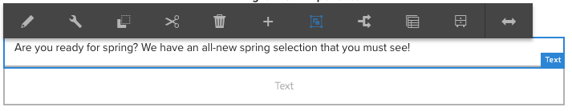

* **Redigera**

  [Beroende på komponenttypen](/help/sites-authoring/default-components.md) kan du [redigera innehållet i komponenten](#edit-content). Ofta finns det ett verktygsfält.

  

* **Konfigurera**

  [Beroende på komponenttypen](/help/sites-authoring/default-components.md) kan du redigera och konfigurera komponentens egenskaper. Ofta öppnas en dialogruta.

  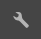

* **Kopiera**

  Komponenten kopieras till Urklipp. Den ursprungliga komponenten behålls efter en inklistring.

  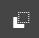

* **Klipp ut**

  Komponenten kopieras till Urklipp. Efter inklistringsåtgärden tas den ursprungliga komponenten bort.

  

* **Ta bort**

  Då tas komponenten bort från sidan med din bekräftelse.

  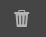

* **Infoga komponent**

  Då öppnas dialogrutan där du kan [lägga till en komponent](/help/sites-authoring/editing-content.md#inserting-a-component-from-the-paragraph-system).

  

* **Klistra in**

  Komponenten klistras in från Urklipp till sidan. Om originalet ska behållas beror på om du har använt kopian eller klippet.

   * Du kan klistra in på samma sida eller på en annan sida.
   * Det inklistrade objektet klistras in ovanför objektet där du väljer åtgärden Klistra in.
   * Åtgärden Klistra in visas bara om det finns innehåll i Urklipp.

  

  >[!NOTE]
  >
  >Om du klistrar in på en annan sida som redan var öppen före klipp ut/kopiera-åtgärden, måste du uppdatera sidan för att se det inklistrade innehållet.

* **Grupp**

  På så sätt kan du markera flera komponenter samtidigt. Samma sak kan uppnås på en stationär enhet genom att **Ctrl-klicka** eller **Kommando-klicka**.

  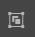

* **Överordnad**

  På så sätt kan du markera den överordnade komponenten för den markerade komponenten.

  

* **Layout**

  Detta gör att du kan ändra [layouten](/help/sites-authoring/editing-content.md#edit-component-layout) för den markerade komponenten. Detta gäller bara den markerade komponenten och aktiverar inte [layoutläget](/help/sites-authoring/author-environment-tools.md#page-modes) för hela sidan.

  

* **Konvertera till en Experience Fragment-variation**

  Detta gör att du kan skapa ett [Experience Fragment](/help/sites-authoring/experience-fragments.md) från den markerade komponenten eller lägga till det i ett befintligt Experience Fragment.

  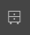

## Redigera (innehåll) {#edit-content}

Det finns två sätt att lägga till eller redigera innehåll i komponenter:

* Öppna [komponentdialogrutan för redigering](#component-edit-dialog).
* [Dra och släpp en resurs](#draganddropintocomponent) från resursläsaren för att lägga till innehåll direkt.

### Komponentredigeringsdialogruta {#component-edit-dialog}

Du kan öppna en komponent och redigera innehållet med ikonen [Redigera (penna) i komponentverktygsfältet](#edit-configure-copy-cut-delete-paste).

De exakta redigeringsalternativen beror på komponenten. För vissa komponenter är [alla åtgärder bara tillgängliga i helskärmsläge](#edit-content-full-screen-mode). Till exempel:

* [Textkomponent](/help/sites-authoring/rich-text-editor.md#main-pars-title-24)

  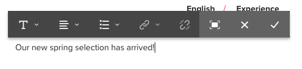

* Bildkomponent

  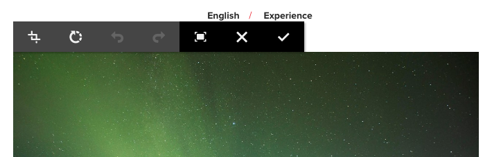

  >[!NOTE]
  >
  >Redigering fungerar inte på en tom bildkomponent.
  >
  >
  >[Dra eller överför en bild (med Konfigurera)](/help/sites-authoring/default-components-foundation.md#image) innan du kan börja redigera den.

* Bildkomponent - helskärm

  [Om du aktiverar helskärmsläge](/help/sites-authoring/editing-content.md#edit-content-full-screen-mode) för bildkomponenten får du mer utrymme för att redigera bilden och visa extra redigeringsalternativ som **Starta karta** och **Återställ zoomning**. I helskärmsläget kan du dessutom välja förinställningar för beskärning.

  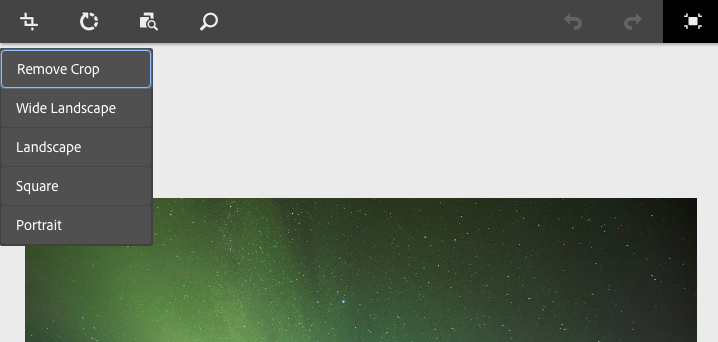

* Komponenter som har konstruerats från mer än en grundläggande komponent, till exempel komponenten [Text och bild](/help/sites-authoring/default-components-foundation.md#text-image), ber dig först bekräfta vilken uppsättning redigeringsalternativ du vill använda:

  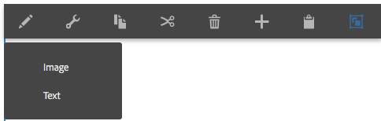

### Dra och släpp Assets i komponenten {#drag-and-drop-assets-into-component}

För specifika komponenttyper kan du dra och släppa resurser från resursläsaren direkt till komponenten för att uppdatera innehållet:

| **Resurstyp** | **Komponenttyp** |
|---|---|
| Bild | Bild |
| Dokument | Ladda ner |
| Produkt | Produkt |
| Video | Flash |
| Innehållsfragment | Innehållsfragment |

## Redigera (innehåll) helskärmsläge {#edit-content-full-screen-mode}

För alla komponenter kan helskärmsläget nås med (och avslutas från):

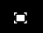

Komponenten **Text**:

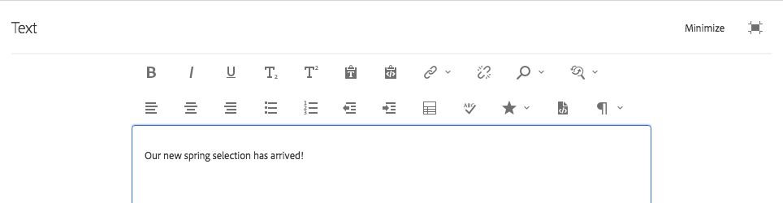

>[!NOTE]
>
>För vissa komponenter har helskärmsläget fler alternativ än den grundläggande redigeraren på plats.

## Flytta en komponent {#moving-a-component}

Så här flyttar du en styckekomponent:

1. Markera det stycke som ska flyttas genom att markera och hålla ned eller klicka och hålla ned.
1. Dra stycket till den nya platsen. AEM anger var stycket kan placeras. Släpp den där du vill.

   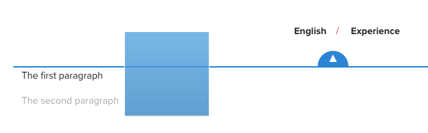

1. Stycket flyttas.

>[!NOTE]
>
>Du kan också använda [Klipp ut och Klistra in](/help/sites-authoring/editing-content.md#edit-configure-copy-cut-delete-paste) för att flytta en komponent.

## Redigera komponentlayout {#edit-component-layout}

I stället för att behöva växla från redigering till [layoutläge](/help/sites-authoring/responsive-layout.md) upprepade gånger för att justera en komponent, kan du välja åtgärden **Layout** för en komponent för att ändra komponentens layout. Detta sparar tid genom att du inte behöver lämna redigeringsläget.

1. När du är i läget **Redigera** för webbplatskonsolen visas komponentens verktygsfält när du väljer en komponent.

   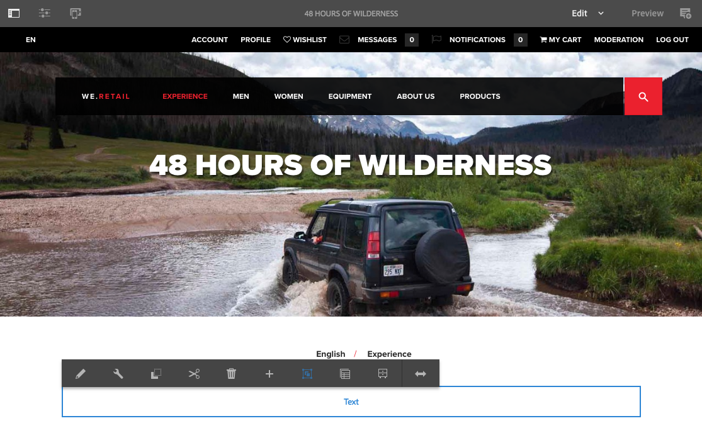

   Klicka på åtgärden **Layout** så att du kan justera komponentens layout.

   

1. När Layout-åtgärden är markerad:

   * Storlekshandtagen för komponentvisningen.
   * Emulatorverktygsfältet visas högst upp på skärmen.
   * Layoutåtgärder i stället för standardredigeringsåtgärder visas i komponentverktygsfältet.

   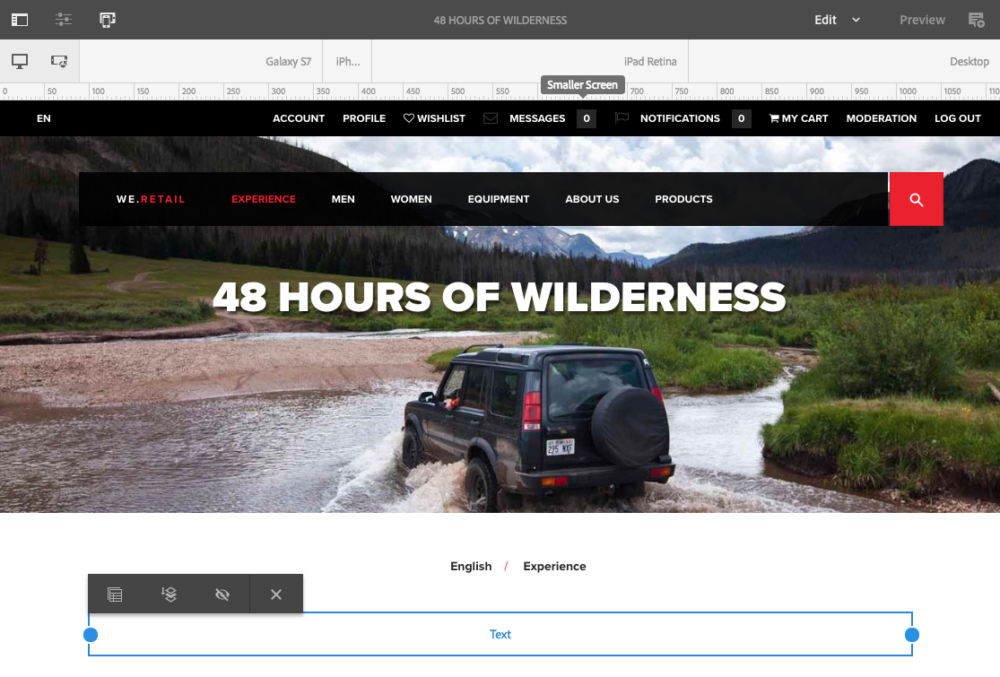

   Nu kan du ändra komponentens layout på samma sätt som i [layoutläget](/help/sites-authoring/responsive-layout.md#defining-layouts-layout-mode).

1. När du har gjort de nödvändiga layoutändringarna klickar du på **Stäng** på komponentens åtgärdsmeny för att sluta ändra komponentens layout. Komponentens verktygsfält återgår till det normala redigeringsläget.

   

>[!NOTE]
>
>Layoutåtgärden är begränsad i omfång till den markerade komponenten. Om du till exempel redigerar layouten för en komponent och sedan markerar en annan komponent, visas standardverktygsfältet för redigering (inte layoutverktygsfältet) för den nyligen markerade komponenten. Storlekshandtagen och emulatorns verktygsfält försvinner.
>
>Om du måste redigera sidans övergripande layout, vilket påverkar flera komponenter, växlar du till [layoutläget](/help/sites-authoring/responsive-layout.md).

## Ärvda komponenter {#inherited-components}

Ärvda komponenter kan vara produkten av olika scenarier, bland annat:

* [Hantering av flera webbplatser](/help/sites-administering/msm.md)
* [Startar](/help/sites-authoring/launches.md) (baserat på live-kopia).
* Specifika komponenter, till exempel det ärvda styckesystemet i Geometrixx.

Du kan avbryta (och sedan återaktivera) arvet. Beroende på vilken komponent det gäller kan det här vara tillgängligt från:

* **Live-kopia**

  Komponentens verktygsfält, om komponenten finns på en sida som är en del av en live-kopia eller en start (baserat på en live-kopia). Till exempel:

  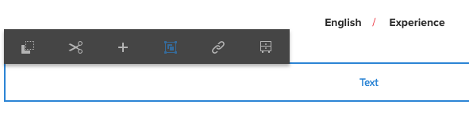

  Alternativet Avbryt arv är tillgängligt:

  

  Eller återaktivera arv om det redan har avbrutits:

  

  Åtgärden Överrullning är även tillgänglig i källan för utkast eller Live-kopia:

  

* **Ett ärvt styckesystem**

  Konfigurationsdialogrutan. Som med det ärvda styckesystemet:

  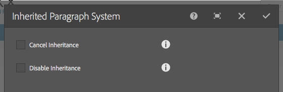

## Redigera sidmallen {#editing-the-page-template}

Om sidan är baserad på en [redigerbar mall](/help/sites-authoring/templates.md#editable-and-static-templates) kan du enkelt växla till [mallredigeraren](/help/sites-authoring/templates.md#editing-templates-template-authors) genom att välja **Redigera mall** på [sidinformationsmenyn](/help/sites-authoring/author-environment-tools.md#page-information).

Om sidan är baserad på en [statisk mall](/help/sites-authoring/templates.md#editable-and-static-templates) kan du växla till [designläge](/help/sites-authoring/default-components-designmode.md) med [sidlägesväljaren](/help/sites-authoring/author-environment-tools.md#page-modes) i verktygsfältet för att aktivera/inaktivera komponenter som ska användas på sidan.

Du kan enkelt se vilken mall sidan baseras på när du markerar sidan i [kolumnvyn](/help/sites-authoring/basic-handling.md#column-view) eller [listvyn](/help/sites-authoring/basic-handling.md#list-view).

## Live Copy-status {#live-copy-status}

I sidläget [Live-kopieringsstatus](/help/sites-authoring/author-environment-tools.md#page-modes) kan du snabbt få en översikt över live-kopians status och vilka komponenter som ärvs/inte ärvs:

* Grön kant: Ärvd
* Rosa kantlinje: Arvet har avbrutits

Till exempel:

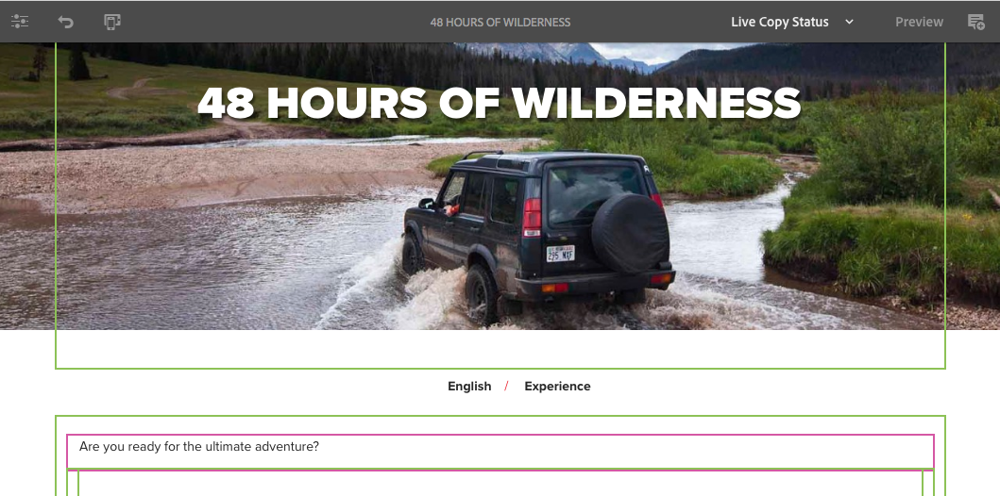

## Lägga till anteckningar {#adding-annotations}

Med [Anteckningar](/help/sites-authoring/annotations.md) kan granskare och andra författare ge feedback på ditt innehåll. De används ofta för granskning och validering.

## Förhandsgranska sidor {#previewing-pages}

Det finns två alternativ för att förhandsgranska en sida:

* [Förhandsgranskningsläge](#preview-mode) - en snabb förhandsgranskning på plats

* [Visa som publicerad](#view-as-published) - en fullständig förhandsgranskning som öppnar sidan på en ny flik

>[!NOTE]
>
>* Länkarna i innehållet är synliga, men inte tillgängliga i redigeringsläget.
>* Använd något av förhandsvisningsalternativen om du vill navigera med hjälp av länkarna.
>* Använd [kortkommandot](/help/sites-authoring/keyboard-shortcuts.md) `Ctrl-Shift-M` för att växla mellan förhandsvisning och det senast markerade läget.
>

>[!NOTE]
>
>WCM-lägets cookie är inställd för båda alternativen.

### Förhandsgranskningsläge {#preview-mode}

När du redigerar innehåll kan du förhandsgranska sidan med [förhandsgranskningsläget](/help/sites-authoring/author-environment-tools.md#page-modes). I det här läget kan du göra följande:

* Dölja olika redigeringsfunktioner så att du kan få en snabb överblick över hur sidan visas när den publiceras.
* Navigera med hjälp av länkar.
* Sidinnehållet uppdateras **inte**.

Vid redigering är förhandsgranskningsläget tillgängligt med hjälp av ikonen längst upp till höger i sidredigeraren:

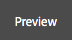

### Visa som publicerad {#view-as-published}

Alternativet **Visa som publicerad** finns på menyn [Sidinformation](/help/sites-authoring/author-environment-tools.md#page-information). Då öppnas sidan på en ny flik, innehållet uppdateras och sidan visas exakt som den ser ut när den publiceras.

## Låsa en sida {#locking-a-page}

Med AEM kan du låsa en sida så att ingen annan kan ändra innehållet. Detta är användbart när du gör flera ändringar på en viss sida eller när du måste frysa en sida en kort stund.

En sida kan låsas från:

* Konsol för **platser**

   1. Markera sidan med [markeringsläge](/help/sites-authoring/basic-handling.md#viewing-and-selecting-resources).
   1. Välj låsikonen.

  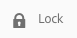

* **Sidredigeraren**

   1. Om du vill öppna menyn väljer du ikonen **Sidinformation** .
   1. Välj alternativet **Lås sida**.

När konsolvyn är låst uppdateras informationen och när du redigerar en låssymbol visas den i verktygsfältet.

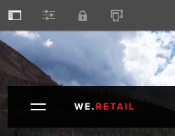

>[!CAUTION]
>
>Du kan låsa en sida när [personifierar en användare](/help/sites-administering/security.md#impersonating-another-user). En sida som är låst på det här sättet kan bara låsas upp av den användare som är imiterad eller av administratörsanvändaren.
>
>Sidorna kan inte låsas upp genom att den användare som låste sidan personifieras.

## Låsa upp en sida {#unlocking-a-page}

Att låsa upp en sida liknar [att låsa sidan](#locking-a-page). När sidan är låst ersätts låsalternativen av upplåsningsåtgärder.

På menyn Sidinformation visas **Lås upp** som ett alternativ och låsikonen på Sites-konsolen ersätts av en **Lås upp**-ikon.

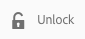

>[!CAUTION]
>
>Du kan låsa en sida när [personifierar en användare](/help/sites-administering/security.md#impersonating-another-user). En sida som är låst på det här sättet kan bara låsas upp av den användare som är imiterad eller av administratörsanvändaren.
>
>Sidorna kan inte låsas upp genom att den användare som låste sidan personifieras.

## Ångra och göra om sidredigeringar {#undoing-and-redoing-page-edits}

Med följande ikoner kan du ångra eller göra om en åtgärd. Dessa visas i verktygsfältet när det är lämpligt:

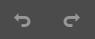

>[!NOTE]
>
>Det [kortkommandot](/help/sites-authoring/page-authoring-keyboard-shortcuts.md) `Ctrl-Z` är även tillgängligt för att ångra sidredigeringsåtgärder.
>
>Kortkommandot `Ctrl-Y` är även tillgängligt för att göra om sidredigeringsåtgärder.

>[!NOTE]
>
>Se [Ångra och Gör om sidredigeringar - Teoriet](#undoing-and-redoing-page-edits-the-theory) för fullständig information om vad som är möjligt när du ångrar och gör om sidredigeringar.

## Ångra och göra om sidredigeringar - The Theory {#undoing-and-redoing-page-edits-the-theory}

>[!NOTE]
>
>Systemadministratören kan [konfigurera olika aspekter av funktionerna Ångra/Gör om ](/help/sites-administering/config-undo.md) enligt kraven för din instans.

AEM lagrar en historik över åtgärder som du utför och i vilken ordning du utförde dem. Den här funktionen innebär att du kan ångra flera åtgärder i den ordning som du utförde dem och göra om dem för att återanvända en eller flera av åtgärderna, om det behövs.

Om ett element på innehållssidan är markerat (till exempel en textkomponent) gäller kommandot ångra och gör om det markerade objektet.

Funktionen för kommandona Ångra och Gör om liknar den i andra program. Använd kommandona för att återställa webbsidans senaste status när du bestämmer dig för innehåll. Om du till exempel flyttar ett textstycke till en annan plats på sidan kan du använda kommandot Ångra för att flytta tillbaka stycket. Om du sedan bestämmer dig för att den föregående positionen var bättre använder du kommandot gör om för att ångra.

>[!NOTE]
>
>Du kan:
>
>* Gör om åtgärder så länge du inte har gjort någon sidredigering sedan du använde Ångra.
>* Ångra högst 20 redigeringsåtgärder (standardinställning).
>* Använd även [kortkommandon](/help/sites-authoring/page-authoring-keyboard-shortcuts.md) för att ångra och göra om.
>

Du kan använda Ångra och Gör om för följande typer av sidändringar:

* Lägga till, redigera, ta bort och flytta stycken
* Redigera styckeinnehåll direkt
* Kopiera, klippa ut och klistra in objekt på en sida

Formulärfält som formulärkomponenter återger ska inte ha värden som anges vid redigering av sidor. Kommandona Ångra och Gör om påverkar därför inte ändringar som du gör i värdena för dessa typer av komponenter. Du kan till exempel inte ångra valet av ett värde i en nedrullningsbar lista.

>[!NOTE]
>
>Särskilda behörigheter krävs för att ångra och göra om ändringar i filer och bilder.

>[!NOTE]
>
>Historiken för ändringar av filer och bilder varar i minst tio timmar. Efter denna tid kan man dock inte garantera att ändringarna återförs. Administratören kan ändra standardtiden på tio timmar.
