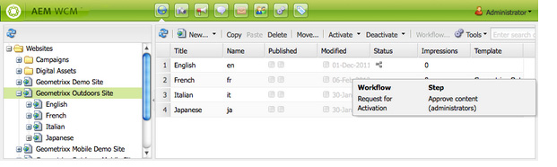

# Använda arbetsflöden på sidor{#applying-workflows-to-pages}

När du använder arbetsflödet anger du följande information:

* Det arbetsflöde som ska användas.

  Du kan använda vilket arbetsflöde som helst (som du fått tillgång till av AEM-administratören).
* Valfritt:

   * En kommentar som ger information om varför du startade arbetsflödet.
   * En titel som hjälper till att identifiera arbetsflödesinstansen i en användares inkorg.

>[!NOTE]
>
>AEM-administratörer kan starta arbetsflöden med [flera andra metoder](/help/sites-administering/workflows-starting.md).

## Använda arbetsflöden {#applying-workflows}

Arbetsflöden kan startas antingen från webbplatskonsolen eller från Sidekick när du redigerar en sida.

Kolumnen **Status** i konsolen **Webbplatser** anger om ett arbetsflöde har tillämpats på en sida:

### Starta ett arbetsflöde från webbplatskonsolen {#starting-a-workflow-from-the-websites-console}

1. Öppna webbplatskonsolen. ([http://localhost:4502/siteadmin](http://localhost:4502/siteadmin))
1. I trädet Webbplatser väljer du den överordnade sidan till sidan som du vill använda arbetsflödet på.
1. Markera sidan i sidlistan och klicka sedan på Arbetsflöde.
1. Välj arbetsflödet som ska användas i dialogrutan Starta arbetsflöde. Du kan även ange en kommentar och en titel. Klicka sedan på Start.

### Starta ett arbetsflöde med Sidekick {#starting-a-workflow-using-sidekick}

1. Öppna webbplatskonsolen.
1. Öppna önskad sida.
1. Välj fliken Arbetsflöde i Sidekick.
1. Utöka dialogrutan **Arbetsflöde** så att du kan välja **arbetsflöde** och ange **arbetsflödets titel** och **Kommentar** om du vill.

   

1. Klicka på **Starta arbetsflöde** om du vill starta en ny arbetsflödesinstans med de egenskaper som du har konfigurerat och den aktuella sidan som nyttolast. Nu körs arbetsflödet.
