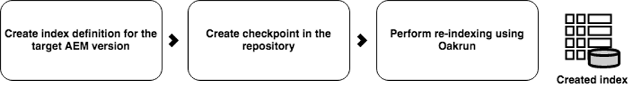

# Omindexering offline för AEM {#offline-reindexing-for-aem}

## Introduktion {#introduction}

För AEM Assets-projekt, som vanligtvis har stora datalager och stora filöverföringar, kan omindexering av Oak-index ta lång tid.

I det här avsnittet beskrivs hur du använder verktyget Oak-körning för att utföra offlineomindexering. Stegen som visas kan användas i [Lucene](https://jackrabbit.apache.org/oak/docs/query/lucene.html) -index för version AEM 6.4 och senare.

## Ökning {#overview}

AEM-databaser kräver ofta omindexering på grund av olika orsaker, t.ex. ändringar av indexdefinitioner, prestandaoptimering eller efter betydande innehållsändringar. Omindexering är dyrt för resursinstallationer eftersom text i resurser (till exempel text i PDF-filer) extraheras och indexeras. Med MongoMK-databaser bevaras data över nätverket vilket ytterligare ökar tiden för omindexering. Lösningen är att utföra omindexering av **offline** med verktyget Oak-kör och sedan importera de fördefinierade indexen till den AEM-instans som körs. Den här metoden minimerar omindexeringstiden och ger bättre resurshantering.

## Metod {#approach}


Tanken är att skapa index offline med verktyget [Oak-run](/help/sites-deploying/indexing-via-the-oak-run-jar.md) och sedan importera dem till den AEM-instans som körs. I bilden ovan visas omindexeringsmetoden offline.

Detta är dessutom ordningen för stegen som beskrivs i metoden:

1. Text från binärfiler extraheras först
2. Indexdefinitioner skapas eller uppdateras
3. Offlineindex skapas
4. Index importeras sedan till den AEM-instans som körs

### Textextrahering {#text-extraction}

Om du vill aktivera fullständig indexering i AEM extraheras och läggs text från binärfiler som PDF till i indexet. Detta är vanligtvis ett dyrt steg i indexeringsprocessen. Textrahering är ett optimeringssteg som rekommenderas särskilt för omindexering av resursdatabaser när stora mängder binärfiler lagras.


Text från binärfiler som lagras i systemet kan extraheras med hjälp av ekkörningsverktyget och kodbiblioteket. En klon av produktionssystemet kan tas och användas för textraheringsprocessen. Den här processen skapar sedan textarkivet genom att gå igenom följande steg:

**1. Bläddra i databasen och samla in information om binärfiler**

I det här steget skapas en CSV-fil som innehåller en tuppel med binärfiler som innehåller en sökväg och ett blob-id.

Kör kommandot nedan från den katalog där du vill skapa indexet. I exemplet nedan används databasens hemkatalog.

```
java java -jar oak-run.jar tika <nodestore path> --fds-path <datastore path> --data-file text-extraction/oak-binary-stats.csv --generate
```

Var `nodestore path` är `mongo_uri` eller `crx-quickstart/repository/segmentstore/`

Använd parametern `--fake-ds-path=temp` i stället för `–fds-path` för att snabba upp processen.

**2. Återanvänd det binära textarkivet som finns i det befintliga indexet**

Dumpa indexdata från det befintliga systemet och extrahera textarkivet.

Du kan dumpa befintliga indexdata med följande kommando:

```
java -jar oak-run.jar index <nodestore path> --fds-path=<datastore path> --index-dump
```

Var `nodestore path` är `mongo_uri` eller `crx-quickstart/repository/segmentstore/`

Använd sedan indexdumpen ovan för att fylla i butiken:

```
java -jar oak-run.jar tika --data-file text-extraction/oak-binary-stats.csv --store-path text-extraction/store --index-dir ./indexing-result/index-dumps/<oak-index-name>/data populate
```

Där `oak-index-name` är namnet på det fullständiga textindexet, till exempel &quot;lucene&quot;.

**3. Kör textraheringsprocessen med kodbiblioteket för binärfilerna som missats i ovanstående steg**

```
java -cp oak-run.jar:tika-app-*.jar org.apache.jackrabbit.oak.run.Main tika --data-file text-extraction/oak-binary-stats.csv --store-path text-extraction/store --fds-path <datastore path> extract
```

>[!NOTE]
>
>Använd samma version av Tika som i AEM.

Där `datastore path` är sökvägen till det binära datalagret.

Det skapade textarkivet kan uppdateras och återanvändas för framtida omindexeringsscenarier.

Mer information om textraheringsprocessen finns i [Oak-körningsdokumentationen](https://jackrabbit.apache.org/oak/docs/query/pre-extract-text.html).

### Omindexering offline {#offline-reindexing}



Skapa Lucene-indexet offline. Om du använder MongoMK bör du köra det direkt på en av MongoMK-noderna, eftersom detta undviker nätverkskostnader.

Så här skapar du indexet offline:

**1. Generera Oak Lucene-indexdefinitioner**

Dumpa de befintliga indexdefinitionerna. Indexdefinitioner kan genereras med Adobe Granites databaskaket och ekar-körning.

Kör det här kommandot om du vill dumpa indexdefinitionen från AEM-instansen:

>[!NOTE]
>
>Mer information om dumpningsindexdefinitioner finns i [Oak-dokumentationen](https://jackrabbit.apache.org/oak/docs/query/oak-run-indexing.html#async-index-data).

```
java -jar oak-run.jar index --fds-path <datastore path> <nodestore path> --index-definitions
```

Var `datastore path` och `nodestore path` kommer från AEM-instansen.

Generera sedan indexdefinitioner med rätt Granite-databaspaket.

```
java -cp oak-run.jar:bundle-com.adobe.granite.repository.jar org.apache.jackrabbit.oak.index.IndexDefinitionUpdater --in indexing-definitions_source.json --out merge-index-definitions_target.json --initializer com.adobe.granite.repository.impl.GraniteContent
```

>[!NOTE]
>
>Processen för att skapa indexdefinitioner ovan stöds endast från och med version `oak-run-1.12.0`. Målsättningen görs med Granite-databaskaketet `com.adobe.granite.repository-x.x.xx.jar`.

Ovanstående steg skapar en JSON-fil med namnet `merge-index-definitions_target.json` som innehåller indexdefinitionen.

**2. Skapa en kontrollpunkt i databasen**

Skapa en kontrollpunkt i produktionen av AEM-instansen med lång livstid. Detta bör göras innan databasen klonas.

Via JMX-konsolen på `http://serveraddress:serverport/system/console/jmx`, gå till `CheckpointMBean` och skapa en kontrollpunkt med lång livslängd (till exempel 200 dagar). Anropa därför `CheckpointMBean#createCheckpoint` med `17280000000` som argument för livstidens längd i millisekunder.

När detta är klart kopierar du det nya kontrollpunkts-ID:t och verifierar livstiden med JMX `CheckpointMBean#listCheckpoints`.

>[!NOTE]
>
>Den här kontrollpunkten tas bort när indexet importeras senare.

Mer information finns i [skapa kontrollpunkter](https://jackrabbit.apache.org/oak/docs/query/oak-run-indexing.html#out-of-band-create-checkpoint) i Oak-dokumentationen.

**Utför offlineindexering för de genererade indexdefinitionerna**

Omindexering av Lucene kan göras offline med ekkörning. Den här processen skapar indexdata på disken under `indexing-result/indexes`. Det skriver **inte** till databasen och behöver därför inte stoppa den AEM-instans som körs. Det skapade textarkivet matas in i den här processen:

```
java -Doak.indexer.memLimitInMB=500 -jar oak-run.jar index <nodestore path> --reindex --doc-traversal-mode --checkpoint <checkpoint> --fds-path <datastore path> --index-definitions-file merge-index-definitions_target.json --pre-extracted-text-dir text-extraction/store

Sample <checkpoint> looks like r16c85700008-0-8
—fds-path: path to data store.
--pre-extracted-text-dir: Directory of pre-extracted text.
merge-index-definitions_target: JSON file having merged definitions for the target AEM instance. indexes in this file will be re-indexed.
```

Användning av parametern `--doc-traversal-mode` är användbar med MongoMK-installationer eftersom omindexeringstiden förbättras avsevärt genom att databasinnehåll mellanlagras i en lokal platt fil. Det kräver dock ytterligare diskutrymme som är dubbelt så stort som databasens storlek.

Om det finns MongoMK kan den här processen accelereras om det här steget körs i en instans som är närmare MongoDB-instansen. Om den körs på samma dator kan nätverksladdning undvikas.

Ytterligare teknisk information finns i [dokumentationen för ekupen för indexering](https://jackrabbit.apache.org/oak/docs/query/oak-run-indexing.html).

### Importera index {#importing-indexes}

Med AEM 6.4 och senare versioner har AEM den inbyggda möjligheten att importera index från disk under startsekvensen. Mappen `<repository>/indexing-result/indexes` bevakas för att se om det finns indexdata under start. Du kan kopiera det förskapade indexet till ovanstående plats innan du startar AEM-instansen. AEM importerar den till databasen och tar bort motsvarande kontrollpunkt från systemet. Därför undviks helt omindexering.

## Fler tips och felsökning {#troubleshooting}

Här nedan hittar du användbara tips och felsökningsanvisningar.

### Minska påverkan på Live Production System {#reduce-the-impact-on-the-live-production-system}

Vi rekommenderar att du klonar produktionssystemet och skapar offlineindexet med klonen. Detta eliminerar eventuella effekter på produktionssystemet. Kontrollpunkten som krävs för import av index måste dock finnas i produktionssystemet. Därför är det viktigt att du skapar en kontrollpunkt innan du tar klonen.

### Förbered en körning av Runbook och testversioner {#prepare-a-runbook-and-trial-run}

Vi rekommenderar att du förbereder en runbook och utför några försök innan du kör omindexeringsprocessen i produktion.

### Dokumentspårningsläge med offlineindexering {#doc-traversal-mode-with-offline-indexing}

Offlineindexering kräver flera genomgångar av hela databasen. Med MongoMK-installationer är databasen åtkomlig via nätverket, vilket påverkar indexeringsprocessens prestanda. Ett alternativ är att köra offlineindexeringsprocessen på själva MongoDB-repliken, vilket eliminerar nätverksbelastningen. Ett annat alternativ är att använda dokumentgenomströmningsläget.

Det går att använda dokumentbläddringsläget genom att lägga till kommandoradsparametern `—doc-traversal` i ekörningskommandot för offlineindexering. I det här läget mellanlagras en kopia av hela databasen på den lokala disken som en platt fil och används för att köra indexeringen.
