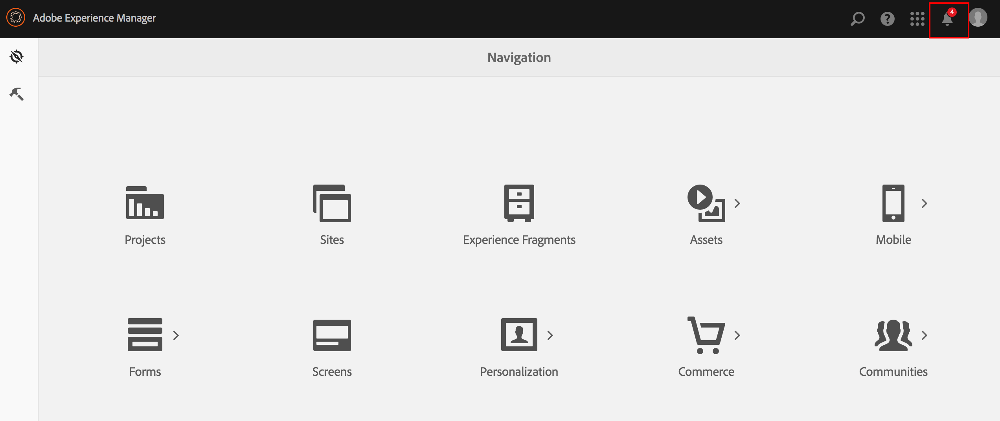
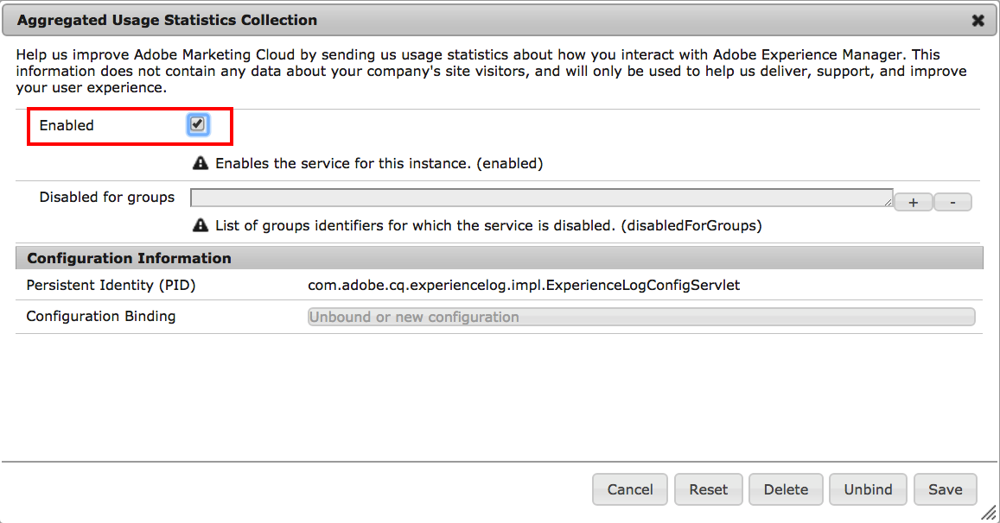

# Anmäl dig till aggregerad användningsstatistik Samling{#opting-into-aggregated-usage-statistics-collection}

## Introduktion {#introduction}

Du kan hjälpa till att förbättra Adobe Experience Cloud genom att skicka Adobe statistik om hur du interagerar med Adobe Experience Manager (AEM). Denna information innehåller inga data om besökarna på företagets webbplats och används endast för att hjälpa Adobe att leverera, ge support och förbättra användarupplevelsen.

Du kan välja att samla in användningsstatistik med hjälp av Touch-gränssnittet eller webbkonsolen.

>[!NOTE]
>
>Det finns olika regler för skydd av personuppgifter och integritet, bland annat GDPR och CCPA. AEM Sites hjälper sina kunder med sina skyldigheter när det gäller skydd av personuppgifter och integritet. På den här sidan får kunderna hjälp med att välja (eller inte) i samlingen Aggregated Usage Statistics.
>
>Mer information finns också i [Adobe Sekretesscenter](https://www.adobe.com/privacy.html).

>[!NOTE]
>
>Du kan när som helst avanmäla dig genom att använda [webbkonsolen]&#x200B;(/help/sites-deploying/opt-in-aggregated-usage-statistics.md#opt-in-by-using-the-web-console, eller välja avanmälningsalternativet på AEM avanmälningsskärm.

## Anmäl dig genom att använda pekgränssnittet {#opt-in-by-using-the-touch-ui}

Första gången du startar AEM kan du välja att använda pekgränssnittet på följande sätt:

1. Klicka på ikonen **Inkorg** (klocka) på navigeringsskärmen i AEM.

   

1. I listrutan klickar du på **Aktivera samling av statistik om aggregerad användning**.

   

1. På skärmen för anmälan klickar du på alternativet **[!UICONTROL Allow collection of aggregated usage statistics]**.

   

1. Klicka på **Klar**.

## Anmäl dig med webbkonsolen {#opt-in-by-using-the-web-console}

Du kan välja att delta (eller avanmäla dig) genom att använda webbkonsolen på följande sätt:

1. På navigeringsskärmen i AEM klickar du på **Verktyg** och sedan på **Åtgärder**.

   

1. Klicka på **Webbkonsol** i åtgärdsfönstret.

   

1. Sök efter **Samling med aggregerad användningsstatistik**.
1. Klicka på ikonen **Redigera** .

   

1. Markera kryssrutan **Aktiverad**. Du kan också avmarkera kryssrutan om du vill avanmäla dig från insamling av användningsstatistik.

   

1. Klicka på **Spara**.
