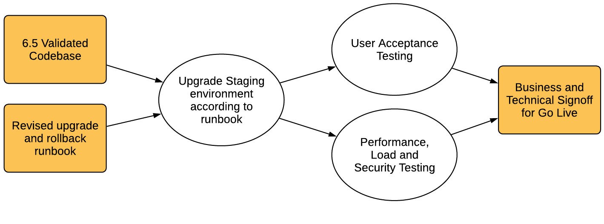

# Planera din uppgradering {#planning-your-upgrade}

## AEM Upgrade Overview {#aem-upgrade-overview}

AEM används ofta i storslagna installationer som kan hjälpa miljontals användare. Vanligtvis finns det anpassade program som distribueras på instanserna, vilket ökar komplexiteten. Alla försök att uppgradera en sådan distribution måste hanteras metodiskt.

Den här guiden hjälper dig att fastställa tydliga mål, faser och slutprodukter när du planerar en uppgradering. Det fokuserar på övergripande uppgraderingskörning och riktlinjer. Den ger en översikt över de faktiska uppgraderingsstegen, men hänvisar till tillgängliga tekniska resurser där det är lämpligt. Den bör användas tillsammans med de tillgängliga tekniska resurser som anges i dokumentet.

AEM uppgraderingsprocess måste noggrant hanteras i planerings-, analys- och körningsfaserna med nyckelresultat definierade för varje fas.

>[!NOTE]
>
>Uppgraderingen till AEM 6.5 LTS stöds från de senaste 6 servicepaketen

Det är viktigt att du kör ett operativsystem som stöds, Java™-miljön, httpd och Dispatcher-versionen. Mer information finns i de [tekniska kraven för AEM 6.5 LTS](/help/sites-deploying/technical-requirements.md). Uppgradering av dessa komponenter måste ingå i din uppgraderingsplan och bör ske innan du uppgraderar AEM.

<!-- Alexandru: drafting for now

## Upgrade Scope and Requirements {#upgrade-scope-requirements}

Below you will find a list of areas that are impacted in a typical AEM Upgrade project:

<table>
 <tbody>
  <tr>
   <td><strong>Component</strong></td>
   <td><strong>Impact</strong></td>
   <td><strong>Description</strong></td>
  </tr>
  <tr>
   <td>Operating System</td>
   <td>Uncertain, but subtle effects</td>
   <td>At the time of the AEM upgrade, it may be time to upgrade the operating system as well and this might have some impact.</td>
  </tr>
  <tr>
   <td>Java&trade; Runtime</td>
   <td>Moderate Impact</td>
   <td>AEM 6.3 requires JRE 1.7.x (64 bit) or later. JRE 1.8 is the only version currently supported by Oracle.</td>
  </tr>
  <tr>
   <td>Hardware</td>
   <td>Moderate Impact</td>
   <td>Online Revision Cleanup requires free  disk space equal to 25% of the repository's size and 15% free heap space  to complete successfully. You may need to upgrade your hardware to  ensure sufficient resources for Online Revision Cleanup to fully  run. Also, if upgrading from a version prior to AEM 6, there  may be additional storage requirements.</td>
  </tr>
  <tr>
   <td>Content Repository (CRX or Oak)</td>
   <td>High Impact</td>
   <td>Starting from version 6.1, AEM does not support CRX2, so a migration to  Oak (CRX3) is required if upgrading from an older version. AEM 6.3 has  implemented a new Segment Node Store that also requires a migration. The  crx2oak tool is used for this purpose.</td>
  </tr>
  <tr>
   <td>AEM Components/Content</td>
   <td>Moderate Impact</td>
   <td><code>/libs</code> and <code>/apps</code> are easily handled through the upgrade, but <code>/etc</code> usually requires some manual reapplication of customizations.</td>
  </tr>
  <tr>
   <td>AEM Services</td>
   <td>Low Impact</td>
   <td>Most AEM core services are tested for upgrade. This is an area of low impact.</td>
  </tr>
  <tr>
   <td>Custom Application Services</td>
   <td>Low to High Impact</td>
   <td>Depending on the application and customization, there may be  dependencies on JVM, operating system versions, and some indexing related  changes, as indexes are not generated automatically in Oak.</td>
  </tr>
  <tr>
   <td>Custom Application Content</td>
   <td>Low to High Impact</td>
   <td>Content that will not be handled through the upgrade can be backed up  before the upgrade takes place and then moved back into the repository.  Most content can be handled through the migration tool.</td>
  </tr>
 </tbody>
</table>

It is important to ensure that you are running a supported operating system, Java&trade; runtime, httpd, and Dispatcher version. For more information, see the [AEM 6.5 Technical Requirements page](/help/sites-deploying/technical-requirements.md). Upgrading these components must be accounted for in your project plan and should take place before upgrading AEM. -->

## Uppgraderingsfasen {#upgrade-phases}

Mycket arbete går åt till att planera och köra en AEM-uppgradering. För att förtydliga de olika arbetsinsatser som ingår i denna process har Adobe delat upp planerings- och exekveringsövningarna i separata faser. I avsnitten nedan resulterar varje fas i en slutprodukt som ofta används i en framtida uppgraderingsfas.

<!-- Alexandru:drafting for now

### Planning for Author Training {#planning-for-author-training}

With any new release, there are potential changes to the UI and user workflows that may be introduced. Also, new releases introduce new features that may be beneficial for the business to use. Adobe recommends reviewing the functional changes that have been introduced and organizing a plan to train your users on using them effectively.

New features in AEM 6.5 can be found in [the AEM section of adobe.com](/help/release-notes/release-notes.md). Make sure to note any changes to UIs or product features that are commonly used in your organization. As you look through the new features, also take note of any that can be of value to your organization. After looking through what has changed in AEM 6.5, develop a training plan for your authors. This could involve using freely available resources like the help feature videos or formal training offered through [Adobe Digital Learning Services](https://learning.adobe.com/). -->

### Skapa en testplan {#creating-a-test-plan}

Varje kunds implementering av AEM är unik och har anpassats för att uppfylla deras affärskrav. Därför är det viktigt att fastställa alla anpassningar som har gjorts i systemet så att de kan inkluderas i en testplan.

Den exakta produktionsmiljön måste dupliceras och testning bör utföras på den efter uppgraderingen för att säkerställa att alla program och anpassad kod fortfarande fungerar som de ska. Regress all anpassning och kör prestanda, inläsning och säkerhetstestning. När du organiserar din testplan måste du ta med alla anpassningar som har gjorts i systemet, förutom de användargränssnitt och arbetsflöden som används i de dagliga åtgärderna. Dessa kan omfatta anpassade OSGI-tjänster och -servrar, integrering med Adobe Experience Cloud, integrering med tredje part via AEM-anslutningar, anpassade tredjepartsintegreringar, anpassade komponenter och mallar, anpassade gränssnittsövertäckningar i AEM samt anpassade arbetsflöden. Dessutom bör anpassade frågor fortfarande testas för att säkerställa att deras index fortsätter att fungera effektivt efter uppgraderingen.

### Utvärderar uppgraderingskomplexitet {#assessing-upgrade-complexity}

På grund av det stora utbudet av anpassningar som Adobe-kunder använder i sina AEM-miljöer är det viktigt att lägga lite tid på att avgöra hur stor arbetsinsatsen ska vara i uppgraderingen. [AEM Analyzer för AEM 6.5 LTS](/help/sites-deploying/pattern-detector.md) kan hjälpa dig att bedöma uppgraderingens komplexitet.

[AEM Analyer för AEM 6.5 LTS](/help/sites-deploying/pattern-detector.md) bör ge en korrekt uppskattning av vad du kan förvänta dig under en uppgradering i de flesta fall. För mer komplexa anpassningar och distributioner där du har inkompatibla ändringar kan du uppgradera en utvecklingsinstans till AEM 6.5 LTS enligt instruktionerna i [Utföra en lokal uppgradering](/help/sites-deploying/in-place-upgrade.md). När det är klart utför du några högnivåröktester på den här miljön. Målet med denna övning är inte att göra en omfattande inventering av testfall och göra en formell inventering av defekter, utan att ge oss en ungefärlig uppskattning av mängden arbete som krävs för att uppgradera koden för AEM 6.5 LTS-kompatibilitet. I kombination med [AEM analyzer](/help/sites-deploying/pattern-detector.md) och de arkitektoniska ändringar som bestämdes i föregående avsnitt kan en grov uppskattning ges till projekthanteringsteamet för planering av uppgraderingen.

### Bygga Runbook för uppgradering och återställning {#building-the-upgrade-and-rollback-runbook}

Adobe har dokumenterat processen för uppgradering av en AEM-instans, men varje kunds nätverkslayout, driftsättningsarkitektur och anpassningar kräver att man finjusterar och skräddarsyr den här metoden. Därför rekommenderar Adobe att du granskar all dokumentation och använder den för att informera en uppgraderingsspecifik Runbook som beskriver de uppgraderings- och återställningsprocedurer som du kommer att följa i din miljö.

<!--Alexandru:drafting for now

 -->

Adobe har tillhandahållit uppgraderings- och återställningsprocedurer i [uppgraderingsproceduren](/help/sites-deploying/upgrade-procedure.md) och stegvisa instruktioner för hur uppgraderingen ska användas i Utföra en [lokal uppgradering](/help/sites-deploying/in-place-upgrade.md). Dessa instruktioner bör granskas och övervägas med din systemarkitektur, anpassningar och driftsavvikelse för att avgöra vilka procedurer för växling och återställning som du ska utföra under uppgraderingen. Alla ändringar av arkitektur eller serverstorlekar bör inkluderas när du skapar din anpassade runbook.

### Utveckla en Upgrade Plan {#developing-an-upgrade-plan}

Utdata från tidigare övningar kan användas för att bygga en uppgraderingsplan som täcker de förväntade tidslinjerna för test- eller utvecklingsarbetet och det faktiska uppgraderingskörningen.

<!--Alexandru: drafting for now

 -->

En omfattande projektplan bör omfatta följande:

* Slutförande av utvecklings- och testplaner
* Uppgraderar utvecklings- och QA-miljöer
* Uppdatera den anpassade kodbasen för AEM 6.5 LTS
* En QA-provning och korrigeringscykel
* Uppgraderar mellanlagringsmiljön
* Integrering, prestanda och belastningstestning
* Miljöcertifiering
* Go live

### Utveckling och kvalitetskontroll {#performing-development-and-qa}

Adobe har tillhandahållit procedurer för [Uppgradering av kod och anpassningar](/help/sites-deploying/upgrading-code-and-customizations.md) som ska vara kompatibla med AEM 6.5 LTS. När den här iterativa processen körs bör ändringar göras i Runbook efter behov.

<!--Alexandru: drafting for now

 -->

Utvecklings- och testprocessen är vanligtvis iterativ. När problem upptäcks som kräver justeringar i uppgraderingsprocessen måste du lägga till dem i din anpassade uppgraderingsrunbook. Efter flera iterationer av testning och korrigering bör kodbasen vara helt validerad och klar för distribution till testmiljön.

### Slutlig testning {#final-testing}

Adobe rekommenderar en sista testomgång efter att kodbasen har certifierats av din organisations QA-team. Denna testomgång innebär att du validerar din runbook i en staging-miljö, följt av rundor där användaren accepteras, prestanda och säkerhetstestning.

<!--Alexandru: drafting for now

 -->

Det här steget är viktigt eftersom det är enda gången som du kan validera stegen i Runbook mot en produktionsliknande miljö. När miljön har uppgraderats är det viktigt att användarna ges tid att logga in och gå igenom de aktiviteter de utför när de använder systemet i sina dagliga aktiviteter. Att hitta och åtgärda problem i dessa områden innan du publicerar produkten kan bidra till att förhindra kostsamma produktionsavbrott.

### Utföra uppgraderingen {#performing-the-upgrade}

När den slutliga signeringen har tagits emot från alla intressenter är det dags att utföra de definierade Runbook-procedurerna. Adobe har tillhandahållit steg för uppgradering och återställning i [uppgraderingsproceduren](/help/sites-deploying/upgrade-procedure.md) och installationssteg i Utföra en [lokal uppgradering](/help/sites-deploying/in-place-upgrade.md) som referenspunkt.

Adobe har tagit del av uppgraderingsinstruktionerna för miljövalidering. Dessa omfattar grundläggande kontroller som att skanna uppgraderingsloggarna och verifiera att alla OSGi-paket har startats korrekt, men Adobe rekommenderar även att du validerar med dina egna testfall baserat på dina affärsprocesser. Adobe rekommenderar också att du kontrollerar schemat för AEM Online Revision Cleanup och tillhörande rutiner för att vara säker på att de inträffar under en lugn tid för ditt företag. Dessa rutiner är viktiga för AEM långsiktiga prestanda.
