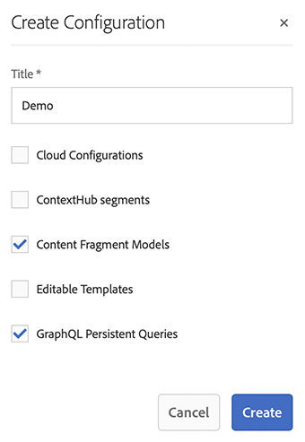

# Skapa en guide till Headless-konfiguration {#creating-configuration}

Som ett första steg mot headless i AEM 6.5 måste du skapa en konfiguration.

## Vad är en konfiguration? {#what-is-a-configuration}

I Configuration Browser finns ett allmänt konfigurations-API, innehållsstruktur och lösningsmekanism för konfigurationer i AEM.

När det gäller headless content management i AEM kan du tänka dig en konfiguration som en arbetsplats i AEM där du kan skapa dina innehållsmodeller, som definierar strukturen för ditt framtida innehåll och dina framtida innehållsfragment. Du kan ha flera konfigurationer för att separera dessa modeller.

>[!NOTE]
>
>Om du är bekant med [sidmallar i en AEM-implementering i full hög ](/help/sites-authoring/templates.md) är användningen av konfigurationer för hantering av innehållsmodeller likartad.

## Så här skapar du en konfiguration {#how-to-create-a-configuration}

En administratör behöver bara skapa en konfiguration en gång, eller mycket sällan, när det krävs en ny arbetsyta för att kunna ordna dina innehållsmodeller. I den här guiden behöver vi bara skapa en konfiguration.

1. Logga in på AEM och välj **Verktyg > Allmänt > Konfigurationsläsaren** på huvudmenyn.
1. Ange en **titel** för din konfiguration.
   * Ett namn genereras automatiskt baserat på titeln och justeras enligt [AEM namnkonventioner.](/help/sites-developing/naming-conventions.md). Det blir nodnamnet i databasen.
1. Markera följande alternativ:
   * **Modeller för innehållsfragment**
   * **GraphQL - beständiga frågor**

   

1. Klicka på **Skapa**

Du kan skapa flera konfigurationer om det behövs. Konfigurationer kan också kapslas.

>[!NOTE]
>
>Konfigurationsalternativ utöver **modeller för innehållsfragment** och **GraphQL beständiga frågor** kan vara nödvändiga beroende på implementeringskraven.

## Nästa steg {#next-steps}

Med den här konfigurationen kan du nu gå vidare till den andra delen av guiden Komma igång och [skapa modeller för innehållsfragment.](create-content-model.md)

<!--
>[!TIP]
>
>For complete details about the Configuration Browser, [see the Configuration Browser documentation.](/help/sites-developing/configurations.md)
-->
