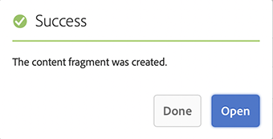

# Skapa innehållsfragment Headless Quick Start Guide {#creating-content-fragments}

Lär dig hur du använder AEM Content Fragments för att utforma, skapa, strukturera och använda sidoberoende innehåll för rubrikfri leverans.

## Vad är innehållsfragment? {#what-are-content-fragments}

[Nu när du har skapat en resursmapp](create-assets-folder.md) där du kan lagra dina innehållsfragment kan du nu skapa fragmenten!

Med Content Fragments kan du utforma, skapa, strukturera och publicera sidoberoende innehåll. De gör att du kan förbereda innehåll för användning på flera platser och i flera kanaler.

Innehållsfragment innehåller strukturerat innehåll och kan levereras i JSON-format.

## Så här skapar du ett innehållsfragment {#how-to-create-a-content-fragment}

Innehållsförfattare skapar valfritt antal innehållsfragment som representerar det innehåll de skapar. Detta kommer att vara deras huvuduppgift i AEM. I den här guiden behöver vi bara skapa en.

1. Logga in på AEM och välj **Navigering > Assets** på huvudmenyn.
1. Navigera till mappen [som du skapade tidigare.](create-assets-folder.md)
1. Klicka på **Skapa > Innehållsfragment**.
1. Skapandet av ett innehållsfragment presenteras som en guide i två steg. Välj först vilken modell du vill använda för att skapa ditt innehållsfragment och klicka sedan på **Nästa**.
   * Vilka modeller som är tillgängliga beror på den [**molnkonfiguration** du definierade för resursmappen](create-assets-folder.md) som du skapar innehållsfragmentet i.
   * Om du får meddelandet `We could not find any models` kontrollerar du konfigurationen för din resursmapp.

   
1. Ange en **titel**, **beskrivning** och **taggar** efter behov och klicka på **Skapa**.

   
1. Klicka på **Öppna** i bekräftelsefönstret.

   
1. Ange information om innehållsfragmentet i Content Fragment Editor.

   
1. Klicka på **Spara** eller **Spara och stäng**.

Innehållsfragment kan referera till andra innehållsfragment, vilket möjliggör en kapslad innehållsstruktur om det behövs.

Innehållsfragment kan också referera till andra resurser i AEM. [Dessa resurser måste lagras i AEM](/help/assets/manage-assets.md) innan du kan skapa ett referensinnehållsfragment.

## Nästa steg {#next-steps}

Nu när du har skapat ett innehållsfragment kan du gå vidare till den sista delen av guiden Komma igång och [skapa API-begäranden för att komma åt och leverera innehållsfragment.](create-api-request.md)

>[!TIP]
>
>Fullständig information om hur du hanterar innehållsfragment finns i [dokumentationen för innehållsfragment](/help/assets/content-fragments/content-fragments.md)
